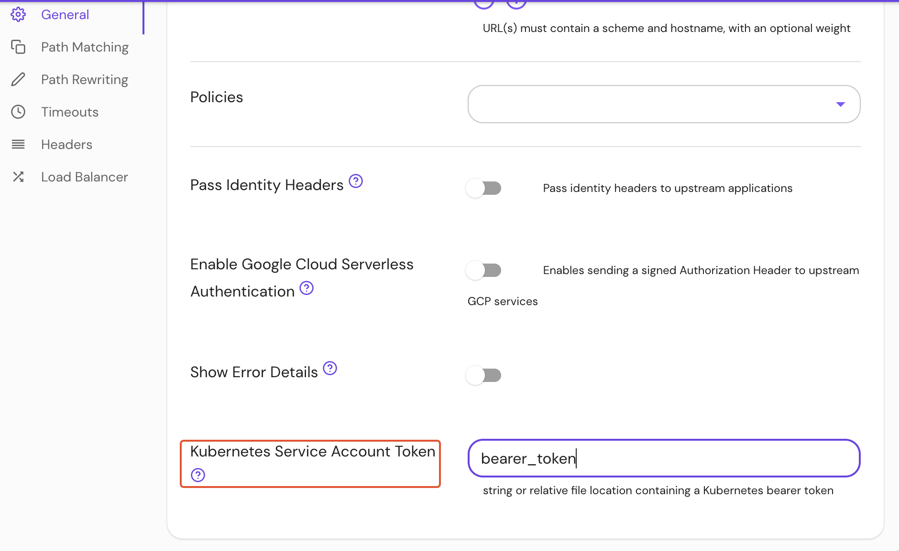

---
# cSpell:ignore serviceaccount

id: kubernetes-service-account-token
title: Kubernetes Service Account Token
keywords:
  - reference
  - Kubernetes Service Account Token
pagination_prev: null
pagination_next: null
---

import Tabs from '@theme/Tabs';
import TabItem from '@theme/TabItem';

# Kubernetes Service Account Token

## Summary

**Kubernetes Service Account Token** authenticates requests to a Kubernetes API server.

Pomerium will [impersonate](https://kubernetes.io/docs/reference/access-authn-authz/authentication/#user-impersonation) the Pomerium user's identity, and Kubernetes RBAC can be applied to identity provider users and groups.

## How to configure

| **Type** | **Usage** |
| :--- | :--- |
| `string` | **optional** |
| `bearer token` file path | **optional** |

<Tabs>
<TabItem value="Enterprise" label="Enterprise">

Set the **Kubernetes Service Account Token** under **General** route settings in the Console:



</TabItem>
<TabItem value="Kubernetes" label="Kubernetes">

| **YAML**/**JSON** settings |
| :--- |
| `kubernetes_service_account_token` |
| `kubernetes_service_account_token_file` |

</TabItem>
</Tabs>

### Examples

```yaml
kubernetes_service_account_token: eyJ0eXAiOiJKV1QiLCJhbGciOiJ...

kubernetes_service_account_token_file: /var/run/secrets/kubernetes.io/serviceaccount/token
```
