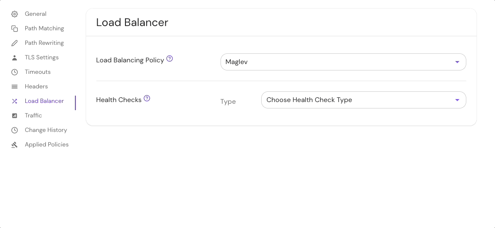

import Tabs from '@theme/Tabs';
import TabItem from '@theme/TabItem';

# Load Balancing Policy

## Summary

**Load Balancing Policy** defines the load balancing strategy between multiple upstream servers.

See [Envoy documentation](https://www.envoyproxy.io/docs/envoy/latest/api-v3/config/cluster/v3/cluster.proto#envoy-v3-api-enum-config-cluster-v3-cluster-lbpolicy) for more details.

## How to configure

| **Type** | **Usage**    | **Default**   |
| :------- | :----------- | :------------ |
| `enum`   | **optional** | `ROUND_ROBIN` |

| **Load Balancer Policy options** |
| :-- |
| [`ROUND_ROBIN`](https://www.envoyproxy.io/docs/envoy/latest/intro/arch_overview/upstream/load_balancing/load_balancers#weighted-round-robin) |
| [`RING_HASH`](https://www.envoyproxy.io/docs/envoy/latest/intro/arch_overview/upstream/load_balancing/load_balancers#ring-hash) (may be further configured using [`ring_hash_lb_config`](https://www.envoyproxy.io/docs/envoy/latest/api-v3/config/cluster/v3/cluster.proto#config-cluster-v3-cluster-ringhashlbconfig) option) |
| [`LEAST_REQUEST`](https://www.envoyproxy.io/docs/envoy/latest/intro/arch_overview/upstream/load_balancing/load_balancers#weighted-least-request) (may be further configured using [`least_request_lb_config`](https://www.envoyproxy.io/docs/envoy/latest/api-v3/config/cluster/v3/cluster.proto#envoy-v3-api-msg-config-cluster-v3-cluster-leastrequestlbconfig)) |
| [`RANDOM`](https://www.envoyproxy.io/docs/envoy/latest/intro/arch_overview/upstream/load_balancing/load_balancers#random) |
| [`MAGLEV`](https://www.envoyproxy.io/docs/envoy/latest/intro/arch_overview/upstream/load_balancing/load_balancers#maglev) (may be further configured using [`maglev_lb_config`](https://www.envoyproxy.io/docs/envoy/latest/api-v3/config/cluster/v3/cluster.proto#envoy-v3-api-msg-config-cluster-v3-cluster-maglevlbconfig) option) |

Some policy types support additional [configuration](/docs/reference/routes/load-balancing-policy-config).

<Tabs>
<TabItem value="Core" label="Core">

| **Config file keys** |
| :------------------- |
| `lb_policy`          |

</TabItem>
<TabItem value="Enterprise" label="Enterprise">

Set the **Load Balancing Policy** in the Console:



</TabItem>
<TabItem value="Kubernetes" label="Kubernetes">

See Kubernetes [Ingress](/docs/deploy/k8s/ingress#load-balancing) for more information

</TabItem>
</Tabs>

### Examples

```yaml
routes:
  - from: https://myapp.localhost.pomerium.io
    to:
      - http://myapp-srv-1:8080
      - http://myapp-srv-2:8080
      - http://myapp-srv-3:8080
      - http://myapp-srv-4:8080
      - http://myapp-srv-5:8080
    lb_policy: LEAST_REQUEST
    least_request_lb_config:
      choice_count: 2 # current envoy default
```
