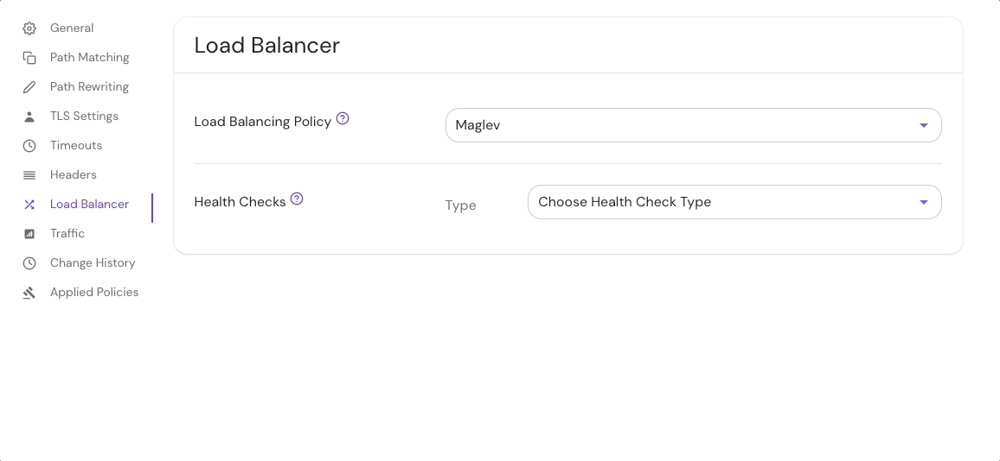

import Tabs from '@theme/Tabs';
import TabItem from '@theme/TabItem';

# Load Balancing Settings

## Load Balancing Policy {#load-balancing-policy}

**Load Balancing Policy** defines the load balancing strategy between multiple upstream servers.

See [Envoy documentation](https://www.envoyproxy.io/docs/envoy/latest/api-v3/config/cluster/v3/cluster.proto#envoy-v3-api-enum-config-cluster-v3-cluster-lbpolicy) for more details.

### How to configure {#how-to-configure-load-balancing-policy}

Some policy types support additional [configuration](/docs/reference/routes/load-balancing#load-balancing-policy-config).

<Tabs>
<TabItem value="Core" label="Core">

| **Config file keys** | **Type** | **Usage**    | **Default**   |
| :------------------- | :------- | :----------- | :------------ |
| `lb_policy`          | `enum`   | **optional** | `ROUND_ROBIN` |

### Examples {#examples-load-balancing-policy}

```yaml
routes:
  - from: https://myapp.localhost.pomerium.io
    to:
      - http://myapp-srv-1:8080
      - http://myapp-srv-2:8080
      - http://myapp-srv-3:8080
      - http://myapp-srv-4:8080
      - http://myapp-srv-5:8080
    lb_policy: LEAST_REQUEST
    least_request_lb_config:
      choice_count: 2 # current envoy default
```

</TabItem>
<TabItem value="Enterprise" label="Enterprise">

Set the **Load Balancing Policy** in the Console:



</TabItem>
<TabItem value="Kubernetes" label="Kubernetes">

| **[Annotation name](/docs/deploy/k8s/ingress#set-ingress-annotations)** | **Type** | **Usage** | **Default** |
| :-- | :-- | :-- | :-- |
| `lb_policy` | `enum` | **optional** | `ROUND_ROBIN` |

### Examples

```yaml
ingress.pomerium.io/lb_policy: LEAST_REQUEST
ingress.pomerium.io/least_request_lb_config: '{"choice_count": 2}'
```

See [Kubernetes - Ingress Configuration](/docs/deploy/k8s/ingress) for more information.

</TabItem>
</Tabs>

### Load Balancing Policy options {#load-balancing-policy-options}

| **Load Balancer Policy options** |
| :-- |
| [`ROUND_ROBIN`](https://www.envoyproxy.io/docs/envoy/latest/intro/arch_overview/upstream/load_balancing/load_balancers#weighted-round-robin) |
| [`RING_HASH`](https://www.envoyproxy.io/docs/envoy/latest/intro/arch_overview/upstream/load_balancing/load_balancers#ring-hash) (may be further configured using [`ring_hash_lb_config`](https://www.envoyproxy.io/docs/envoy/latest/api-v3/config/cluster/v3/cluster.proto#config-cluster-v3-cluster-ringhashlbconfig) option) |
| [`LEAST_REQUEST`](https://www.envoyproxy.io/docs/envoy/latest/intro/arch_overview/upstream/load_balancing/load_balancers#weighted-least-request) (may be further configured using [`least_request_lb_config`](https://www.envoyproxy.io/docs/envoy/latest/api-v3/config/cluster/v3/cluster.proto#envoy-v3-api-msg-config-cluster-v3-cluster-leastrequestlbconfig)) |
| [`RANDOM`](https://www.envoyproxy.io/docs/envoy/latest/intro/arch_overview/upstream/load_balancing/load_balancers#random) |
| [`MAGLEV`](https://www.envoyproxy.io/docs/envoy/latest/intro/arch_overview/upstream/load_balancing/load_balancers#maglev) (may be further configured using [`maglev_lb_config`](https://www.envoyproxy.io/docs/envoy/latest/api-v3/config/cluster/v3/cluster.proto#envoy-v3-api-msg-config-cluster-v3-cluster-maglevlbconfig) option) |

## Health Checks {#health-checks}

When defined, **Health Checks** will issue periodic health check requests to upstream servers and unhealthy upstream servers won't serve traffic.

See Envoy's [`outlier_detection`](https://www.envoyproxy.io/docs/envoy/latest/intro/arch_overview/upstream/outlier) for automatic upstream server health detection. In the presence of multiple upstream servers, it is recommended to set up either `health_checks`, `outlier_detection`, or both.

### Supported health checks parameters

| **Config file keys** | **Definition** | **Type** | **Usage** |
| :--- | :--- | :--- | :--- |
| `timeout` | The total time to wait for a health check response. | [`Duration`](https://developers.google.com/protocol-buffers/docs/reference/google.protobuf#duration) | **required** |
| `interval` | The interval between health checks. | [`Duration`](https://developers.google.com/protocol-buffers/docs/reference/google.protobuf#duration) | **required** |
| `unhealthy_threshold` | The number of unhealthy health checks required before a host is marked unhealthy. | [`UInt32Value`](https://developers.google.com/protocol-buffers/docs/reference/google.protobuf#uint32value) | **required** |
| `healthy_threshold` | The number of healthy health checks required before a host is marked healthy. | [`UInt32Value`](https://developers.google.com/protocol-buffers/docs/reference/google.protobuf#uint32value) | **required** |

See the [Envoy documentation](https://www.envoyproxy.io/docs/envoy/latest/intro/arch_overview/upstream/health_checking) for a list of [supported parameters](https://www.envoyproxy.io/docs/envoy/latest/api-v3/config/core/v3/health_check.proto#envoy-v3-api-msg-config-core-v3-healthcheck).

### How to configure {#how-to-configure-health-checks}

You may configure only one of the following options per `health_check` object definition:

- `http_health_check`
- `tcp_health_check`
- `grpc_health_check`

#### HTTP health check {#http-healthcheck-overview}

| **Config file keys** | **Definition** | **Type** | **Usage** |
| :--- | :--- | :--- | :--- |
| `host` | The Host header value in the HTTP health check request. If empty (default value), the name of the cluster this health check is associated with will be used. | `string` | **optional** |
| `path` | Specifies the HTTP path requested during a health check. For example, `/healthcheck`. | `string` | **required** |
| `expected_statuses` | Defines a range of HTTP response statuses that are considered healthy. | [`Int64Range`](https://www.envoyproxy.io/docs/envoy/latest/api-v3/type/v3/range.proto#envoy-v3-api-msg-type-v3-int64range) | **optional** |
| `codec_client_type` | Specifies which application protocol to use: `HTTP1` or `HTTP2`. | [`CodeClientType`](https://www.envoyproxy.io/docs/envoy/latest/api-v3/type/v3/http.proto#envoy-v3-api-enum-type-v3-codecclienttype) | **optional** |

See the [Envoy HTTP health checks documentation](https://www.envoyproxy.io/docs/envoy/latest/api-v3/config/core/v3/health_check.proto#envoy-v3-api-msg-config-core-v3-healthcheck-httphealthcheck) for more information.

#### TCP health check {#tcp-healthcheck-overview}

| **Config file keys** | **Definition** | **Type** | **Usage** |
| :--- | :--- | :--- | :--- |
| `send` | Defines the payload, which must be one of [text](https://www.envoyproxy.io/docs/envoy/latest/api-v3/config/core/v3/health_check.proto#envoy-v3-api-field-config-core-v3-healthcheck-payload-text) or [binary](https://www.envoyproxy.io/docs/envoy/latest/api-v3/config/core/v3/health_check.proto#envoy-v3-api-field-config-core-v3-healthcheck-payload-binary). An empty payload results in a connect-only health check. | [`Payload`](https://www.envoyproxy.io/docs/envoy/latest/api-v3/config/core/v3/health_check.proto#envoy-v3-api-msg-config-core-v3-healthcheck-payload) | **optional** |
| `receive` | Checks a response with 'fuzzy' matching to the extent that each payload block must be found, and in the specified order, but not necessarily contiguous. | [`Payload`](https://www.envoyproxy.io/docs/envoy/latest/api-v3/config/core/v3/health_check.proto#envoy-v3-api-msg-config-core-v3-healthcheck-payload) | **optional** |

See the [Envoy TCP health checks documentation](https://www.envoyproxy.io/docs/envoy/latest/api-v3/config/core/v3/health_check.proto#config-core-v3-healthcheck-tcphealthcheck) for more information.

#### gRPC health check {#grpc-healthcheck-overview}

| **Config file keys** | **Definition** | **Type** | **Usage** |
| :--- | :--- | :--- | :--- |
| `authority` | The `:authority` header value in a gRPC health check request. | `string` | **optional** |
| `service_name` | A service name parameter sent to the gRPC service. See [gRPC health checking](https://github.com/grpc/grpc/blob/master/doc/health-checking.md) for more information.| `string` | **optional** |

See the [Envoy gRPC health checks documentation](https://www.envoyproxy.io/docs/envoy/latest/api-v3/config/core/v3/health_check.proto#config-core-v3-healthcheck-grpchealthcheck) for more information.

<Tabs>
<TabItem value="Core" label="Core">

| **Config file keys** | **Type**           | **Usage**    |
| :------------------- | :----------------- | :----------- |
| `health_checks`      | `array of objects` | **optional** |

See [Load Balancing](/docs/capabilities/load-balancing.md) for example [configurations](/docs/capabilities/load-balancing.md#active-health-checks).

</TabItem>
<TabItem value="Enterprise" label="Enterprise">

Configure **Health Checks** under **Load Balancing** settings in the Console:


</TabItem>
<TabItem value="Kubernetes" label="Kubernetes">

See Kubernetes [Ingress - load balancing](/docs/deploy/k8s/ingress#load-balancing) for more information.

</TabItem>
</Tabs>
