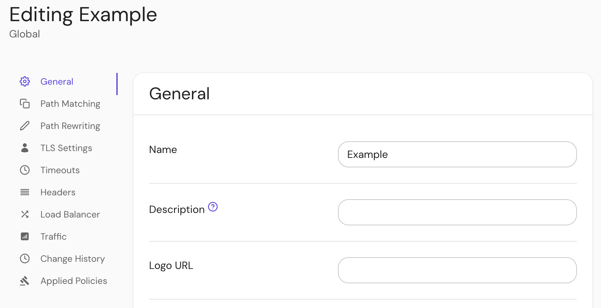

import TabItem from '@theme/TabItem';
import Tabs from '@theme/Tabs';

import EnterpriseConfiguration from '../../../../src/components/EnterpriseConfiguration';

# Route Logo URL

## Summary

Route logo URL shown in the routes portal.

## How to configure

<Tabs>
<TabItem value="Core" label="Core">

| **Config file key** | **Type** | **Usage**    |
| :------------------ | :------- | :----------- |
| `logo_url`          | `string` | **optional** |

</TabItem>
<TabItem value="Enterprise" label="Enterprise">
<EnterpriseConfiguration name="logo_url" resource="route">

Set the route **logo URL** under **General** route settings in the Console:

</EnterpriseConfiguration>
</TabItem>
<TabItem value="Kubernetes" label="Kubernetes">

| **[Annotation name](/docs/deploy/k8s/ingress#set-ingress-annotations)** | **Type** | **Usage** |
| :-- | :-- | :-- |
| `logo_url` | `string` | **optional** |

</TabItem>
</Tabs>
