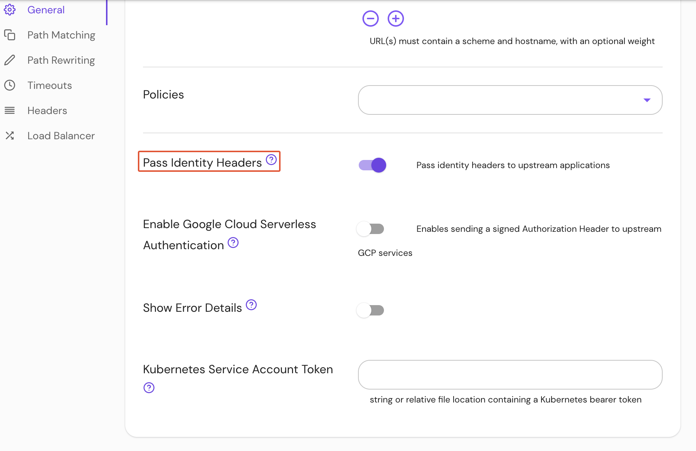

import Tabs from '@theme/Tabs';
import TabItem from '@theme/TabItem';

# Pass Identity Headers

## Summary

When set, **Pass Identity Headers** will pass identity headers to the upstream application.

These headers include:
- `X-Pomerium-Jwt-Assertion`
- `X-Pomerium-Claim-*` (see [JWT Claim Headers](/docs/reference/jwt-claim-headers) for more information)

## How to configure

| **Type** | **Usage** | **Default** |
| :--- | :--- | :--- |
| `boolean` | **optional** | `false` |

<Tabs>
<TabItem value="Core" label="Core">

| **YAML**/**JSON** setting |
| :--- |
| `pass_identity_headers` |

</TabItem>
<TabItem value="Enterprise" label="Enterprise">

Set **Pass Identity Headers** under **General** route settings in the Console:



</TabItem>
<TabItem value="Kubernetes" label="Kubernetes">

See Kubernetes [Ingress](/docs/deploying/k8s/ingress#annotations) for more information

</TabItem>
</Tabs>

### Examples

```yaml
routes:
  - from: https://verify.localhost.pomerium.io
    to: http://verify:8000
    pass_identity_headers: true
```
