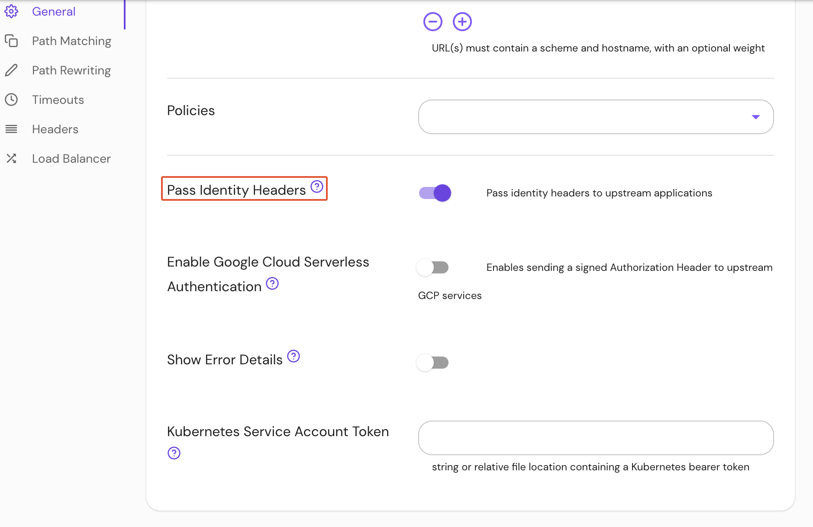

import TabItem from '@theme/TabItem';
import Tabs from '@theme/Tabs';

import EnterpriseConfiguration from '../../../../src/components/EnterpriseConfiguration';

# Pass Identity Headers (per route)

## Summary

When set to true, the **Pass Identity Headers (per route)** setting will pass identity headers to the upstream application.

The default value for this setting is controlled by the [global-level Pass Identity Headers](/docs/reference/pass-identity-headers) setting.

Identity headers include:

- `X-Pomerium-Jwt-Assertion`
- `X-Pomerium-Claim-*` (see [JWT Claim Headers](/docs/reference/jwt-claim-headers) for more information)

## How to configure

<Tabs>
<TabItem value="Core" label="Core">

| **YAML**/**JSON** setting | **Type**  | **Usage**    |
| :------------------------ | :-------- | :----------- |
| `pass_identity_headers`   | `boolean` | **optional** |

### Examples

```yaml
routes:
  - from: https://verify.localhost.pomerium.io
    to: http://verify:8000
    pass_identity_headers: true
```

</TabItem>
<TabItem value="Enterprise" label="Enterprise">
<EnterpriseConfiguration name="pass_identity_headers" resource="route">

Set **Pass Identity Headers** under **General** route settings in the Console:



</EnterpriseConfiguration>
</TabItem>
<TabItem value="Kubernetes" label="Kubernetes">

| **[Annotation name](/docs/deploy/k8s/ingress#set-ingress-annotations)** | **Type** | **Usage** | **Default** |
| :-- | :-- | :-- | :-- |
| `pass_identity_headers` | `boolean` | **optional** | `false` |

```yaml
ingress.pomerium.io/pass_identity_headers: 'true'
```

</TabItem>
</Tabs>
