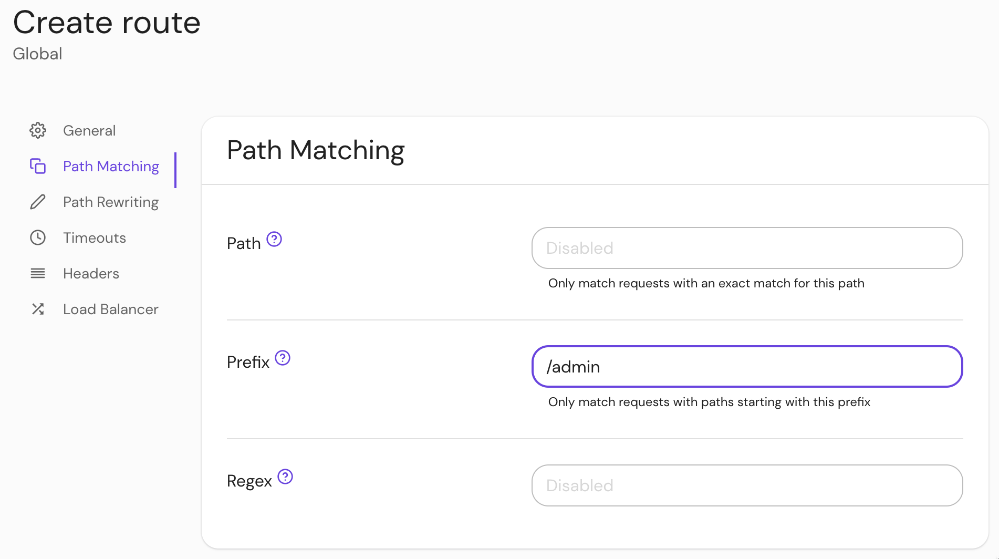

    ---
    title: Path Handling Settings
    sidebar_label: Path Handling Settings
    description: Configure Path Matching and Path Rewriting settings in Pomerium.
    keywords: [path, prefix, regex, prefix rewrite, regex rewrite pattern, regex rewrite substitution]
    pagination_prev: null
    pagination_next: null
    toc_max_heading_level: 2
    ---

    import Tabs from '@theme/Tabs';
    import TabItem from '@theme/TabItem';

    # Path Handling Settings

    This reference covers all of Pomerium's **Path Matching and Rewriting Settings**:

    ## Path Matching

    ### Path {#path}

    If **Path** is set, the route will only match incoming requests with a path that is an exact match for the specified path.

    #### How to configure {#how-to-configure-path}

    <Tabs>
    <TabItem value="Core" label="Core">

    | **YAML**/**JSON** setting | **Type** | **Usage**    |
    | :------------------------ | :------- | :----------- |
    | `path`                    | `string` | **optional** |

    ##### Examples {#examples-path}

    ```yaml
    routes:
      - from: https://verify.localhost.pomerium.io
        to: http://verify:8000
        path: /admin/some/exact/path
    ```

    </TabItem>
    <TabItem value="Enterprise" label="Enterprise">

    Set **Path** under **Path Matching** settings in the Console:

    

    </TabItem>
    <TabItem value="Kubernetes" label="Kubernetes">

    See Kubernetes [Ingress](/docs/deploy/k8s/ingress#regular-expressions-path-matching) for more information

    </TabItem>
    </Tabs>

    ### Prefix {#prefix}

    If **Prefix** is set, the route will only match incoming requests with a path that begins with the specified prefix.

    #### How to configure {#how-to-configure-prefix}

    <Tabs>
    <TabItem value="Core" label="Core">

    | **YAML**/**JSON** setting | **Type** | **Usage**    |
    | :------------------------ | :------- | :----------- |
    | `prefix`                  | `string` | **optional** |

    ##### Examples {#examples-prefix}

    ```yaml
    from: https://from.example.com
    to: https://to.example.com
    prefix: /admin
    ```

    </TabItem>
    <TabItem value="Enterprise" label="Enterprise">

    Set the **Prefix** in **Path Matching** settings:

    

    </TabItem>
    <TabItem value="Kubernetes" label="Kubernetes">

    | **Name** | **Type** | **Usage**    |
    | :------- | :------- | :----------- |
    | `Prefix` | `string` | **optional** |

    ```yaml
    spec:
      ingressClassName: pomerium
      rules:
        - host: example.localhost.pomerium.io
          http:
            paths:
              - backend:
                  service:
                    name: example
                    port:
                      name: http
                path: /
                pathType: Prefix
    ```

    See Kubernetes [Ingress](/docs/deploy/k8s/ingress#annotations) for more information

    </TabItem>
    </Tabs>

    ### Regex {#regex}

    If **Regex** is set, the route will only match incoming requests with a path that matches the specified regular expression. The supported syntax is the same as the Go [regexp package](https://golang.org/pkg/regexp/) which is based on [re2](https://github.com/google/re2/wiki/Syntax).

    #### How to configure {#how-to-configure-regex}

    <Tabs>
    <TabItem value="Core" label="Core">

    | **YAML**/**JSON** setting | **Type** | **Usage**    |
    | :------------------------ | :------- | :----------- |
    | `regex`                   | `string` | **optional** |

    ##### Examples {#examples-regex}

    ```yaml
    regex: '^/(admin|superuser)/.*$'
    ```

    </TabItem>
    <TabItem value="Enterprise" label="Enterprise">

    Set **Regex** in the Console:

    

    </TabItem>
    <TabItem value="Kubernetes" label="Kubernetes">

    | **Name**     | **Type** | **Usage**    |
    | :----------- | :------- | :----------- |
    | `path_regex` | `string` | **optional** |

    ##### Examples {#examples-regex-k8s}

    ```yaml
        ingress.pomerium.io/path_regex: 'true'
      name: example
    spec:
      ingressClassName: pomerium
      rules:
        - host: example.localhost.pomerium.io
          http:
            paths:
              - backend:
                  service:
                    name: example
                    port:
                      name: http
                path: ^/(admin|superuser)/.*$
                pathType: ImplementationSpecific
    ```

    </TabItem>
    </Tabs>
