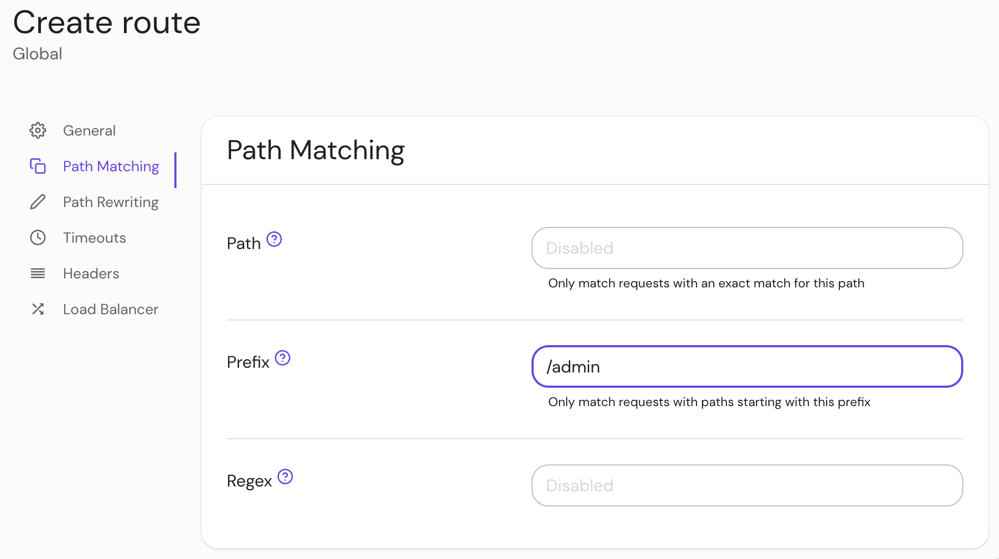
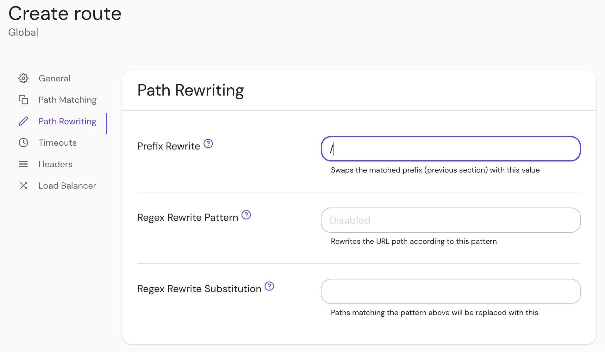
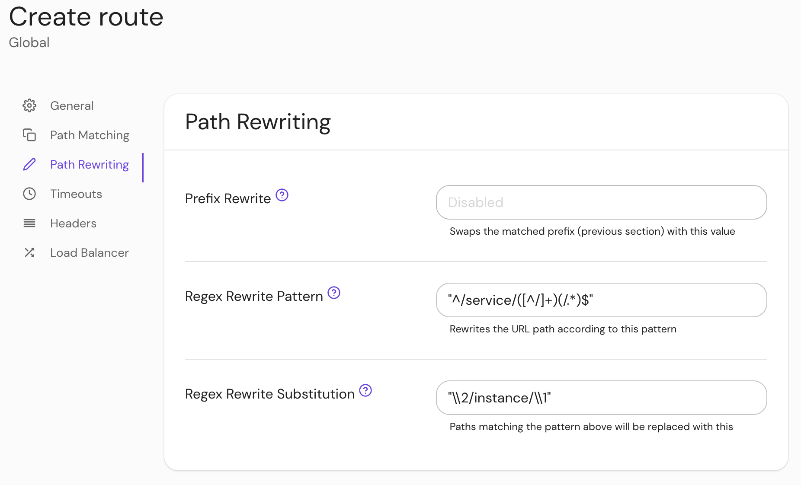

import Tabs from '@theme/Tabs';
import TabItem from '@theme/TabItem';

# Path Rewriting Settings

This reference covers all of Pomerium's **Path Rewriting Settings**:

- [Prefix Rewrite](#prefix-rewrite)
- [Regex Rewrite Pattern](#regex-rewrite)
- [Regex Rewrite Substitution](#regex-rewrite)

## Prefix Rewrite {#prefix-rewrite}

If set, **Prefix Rewrite** indicates that during forwarding, the matched prefix (or path) should be swapped with this value.

### How to configure {#how-to-configure-prefix-rewrite}

<Tabs>
<TabItem value="Core" label="Core">

| **YAML**/**JSON** setting | **Type** | **Usage**    |
| :------------------------ | :------- | :----------- |
| `prefix_rewrite`          | `string` | **optional** |

</TabItem>
<TabItem value="Enterprise" label="Enterprise">

Configure **Prefix Rewrite** in the Console:

1. Set the **Prefix** in **Path Matching** settings:



2. Set the **Prefix Rewrite** in **Path Rewriting** settings:



</TabItem>
<TabItem value="Kubernetes" label="Kubernetes">

| **[Annotation name](/docs/deploy/k8s/ingress#set-ingress-annotations)** | **Type** | **Usage** |
| :-- | :-- | :-- |
| `prefix_rewrite` | `string` | **optional** |

</TabItem>
</Tabs>

### Examples {#examples-prefix-rewrite}

```yaml
from: https://from.example.com
to: https://to.example.com
prefix: /admin
prefix_rewrite: /
```

A request to `https://from.example.com/admin` would be forwarded to `https://to.example.com/`.

## Regex Rewrite {#regex-rewrite}

If **Regex Rewrite** or **Regex Rewrite Substitution** are set, the URL path will be rewritten according to the pattern and substitution, similar to [`prefix_rewrite`](/docs/reference/routes/path-rewriting#prefix-rewrite).

### How to configure {#how-to-configure-regex-rewrite}

<Tabs>
<TabItem value="Core" label="Core">

| **YAML**/**JSON** setting    | **Type** | **Usage**    |
| :--------------------------- | :------- | :----------- |
| `regex_rewrite_pattern`      | `string` | **optional** |
| `regex_rewrite_substitution` | `string` | **optional** |

</TabItem>
<TabItem value="Enterprise" label="Enterprise">

Set **Regex Rewrite** pattern and substitution in the Console:



</TabItem>
<TabItem value="Kubernetes" label="Kubernetes">

Kubernetes does not support **Regex Rewrite**

</TabItem>
</Tabs>

### Examples {#examples-regex-rewrite}

```yaml
regex_rewrite_pattern: '^/service/([^/]+)(/.*)$'
regex_rewrite_substitution: "\\2/instance/\\1"
```
