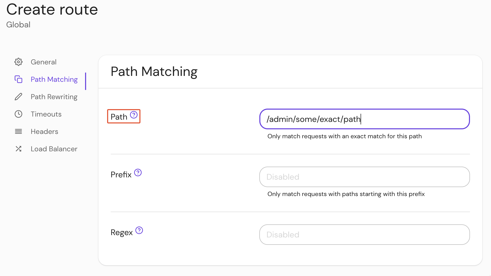

import Tabs from '@theme/Tabs';
import TabItem from '@theme/TabItem';

# Path

## Summary

If **Path** is set, the route will only match incoming requests with a path that is an exact match for the specified path.

## How to configure

<Tabs>
<TabItem value="Core" label="Core">

| **YAML**/**JSON** setting | **Type** | **Usage**    |
| :------------------------ | :------- | :----------- |
| `path`                    | `string` | **optional** |

</TabItem>
<TabItem value="Enterprise" label="Enterprise">

Set **Path** under **Path Matching** settings in the Console:



</TabItem>
<TabItem value="Kubernetes" label="Kubernetes">

See Kubernetes [Ingress](/docs/deploy/k8s/ingress#regular-expressions-path-matching) for more information

</TabItem>
</Tabs>

### Examples

```yaml
routes:
  - from: https://verify.localhost.pomerium.io
    to: http://verify:8000
    path: /admin/some/exact/path
```
