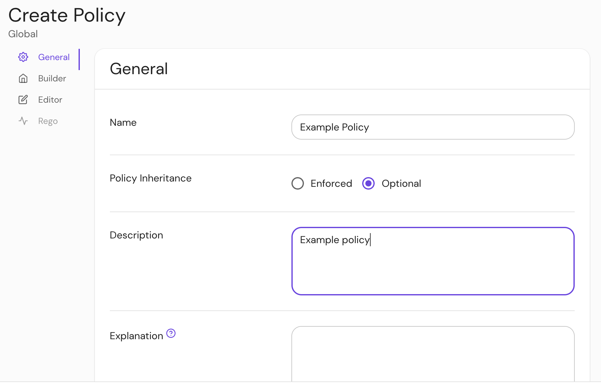
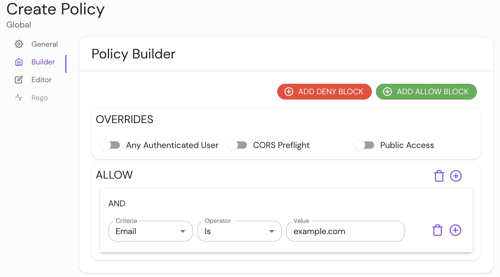
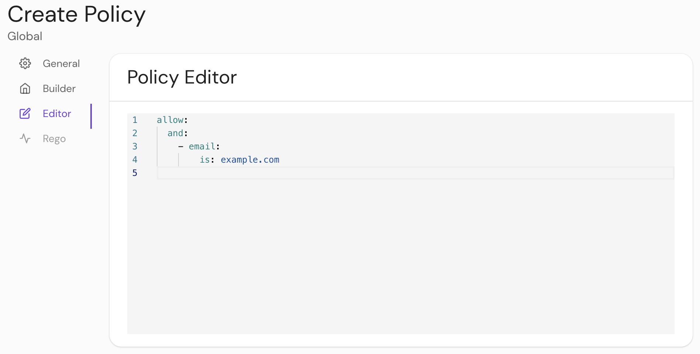

import Tabs from '@theme/Tabs';
import TabItem from '@theme/TabItem';

# Policy

## Summary

The `policy` block inside a `route` definition defines the authorization policy applied to a route. Policies are defined using Pomerium Policy Language (**PPL**), a yaml-based markup designed to be easier to read and implement compared to current alternatives.

See [Pomerium Policy Language](/docs/capabilities/ppl) for a full explanation of how to write policies in PPL.

## How to configure

<Tabs>
<TabItem value="Core" label="Core">

| **YAML**/**JSON** setting | **Type** | **Usage**    |
| :------------------------ | :------- | :----------- |
| `policy`                  | `string` | **optional** |

</TabItem>
<TabItem value="Enterprise" label="Enterprise">

Build a **Policy** in the Console:

Create a policy:



Add actions and rules in the **Policy Builder**:



Edit your policy:



</TabItem>
<TabItem value="Kubernetes" label="Kubernetes">

| **[Annotation name](/docs/deploy/k8s/ingress#set-authorization-policy)** | **Type** | **Usage** |
| :-- | :-- | :-- |
| `policy` | `string` | **optional** |

See Kubernetes [Ingress](/docs/deploy/k8s/ingress#access-policy-examples) for more information

</TabItem>
</Tabs>

### Examples

```yaml
routes:
  - from: https://verify.localhost.pomerium.io
    to: http://verify:8000
    policy:
      - allow:
          and:
            - domain:
                is: pomerium.com
            - user:
                is: user

# ingress
ingress.pomerium.io/policy: |
  allow:
    and:
      - domain:
          is: pomerium.com
      - user:
          is: user
```

</TabItem>
</Tabs>
