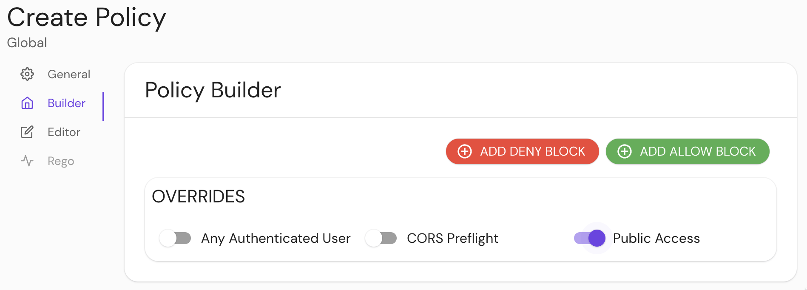

import Tabs from '@theme/Tabs';
import TabItem from '@theme/TabItem';

# Public Access

## Summary

**Use with caution:** **Public Access** allows all requests for a given route, bypassing authentication and authorization. Suitable for publicly exposed web services.

If this setting is enabled, no whitelists (for example, Allowed Users) should be provided in this route.

## How to configure

| **Type**  | **Default** | **Usage**    |
| :-------- | :---------- | :----------- |
| `boolean` | `false`     | **optional** |

<Tabs>
<TabItem value="Core" label="Core">

| **YAML**/**JSON** setting             |
| :------------------------------------ |
| `allow_public_unauthenticated_access` |

</TabItem>
<TabItem value="Enterprise" label="Enterprise">

Enable **Public Access** in the **Policy Builder** in the Console:



</TabItem>
<TabItem value="Kubernetes" label="Kubernetes">

| **Name**                              |
| :------------------------------------ |
| `allow_public_unauthenticated_access` |

See Kubernetes [Ingrss](/docs/deploying/k8s/ingress) for more information

</TabItem>
</Tabs>

### Examples

```yaml
allow_public_unauthenticated_access: true
```
