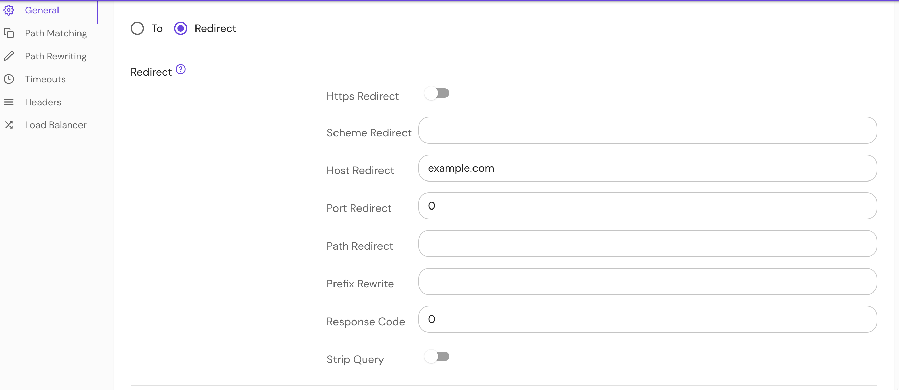

import Tabs from '@theme/Tabs';
import TabItem from '@theme/TabItem';

# Redirect

## Summary

The **Redirect** setting redirects incoming requests to a new URL.

## How to configure

Either `redirect` or [`to`](/docs/reference/routes/to) must be set.

<Tabs>
<TabItem value="Core" label="Core">

| **YAML**/**JSON** setting | **Type** | **Usage**    |
| :------------------------ | :------- | :----------- |
| `redirect`                | `object` | **optional** |

</TabItem>
<TabItem value="Enterprise" label="Enterprise">

Configure **Redirect** in the Console:



</TabItem>
<TabItem value="Kubernetes" label="Kubernetes">

Kubernetes does not support **Redirect**

</TabItem>
</Tabs>

### Redirect options

The `redirect` field is an object with the following options:

| **Options** | **Type** | **Definition** |
| :-- | :-- | :-- |
| `https_redirect` | `boolean` | The incoming scheme will be swapped with "https". |
| `scheme_redirect` | `string` | The incoming scheme will be swapped with the given value. |
| `host_redirect` | `string` | The incoming host will be swapped with the given value. |
| `port_redirect` | `integer` | The incoming port will be swapped with the given value. |
| `path_redirect` | `string` | The incoming path portion of the URL will be swapped with the given value. |
| `prefix_rewrite` | `string` | The incoming matched prefix will be swapped with the given value. |
| `response_code` | `integer` | The response code to use for the redirect. Defaults to 301. |
| `strip_query` | `boolean` | Indicates that during redirection, the query portion of the URL will be removed. Defaults to `false`. |

### Examples

```yaml
redirect: {'host_redirect': 'example.com'}
```
