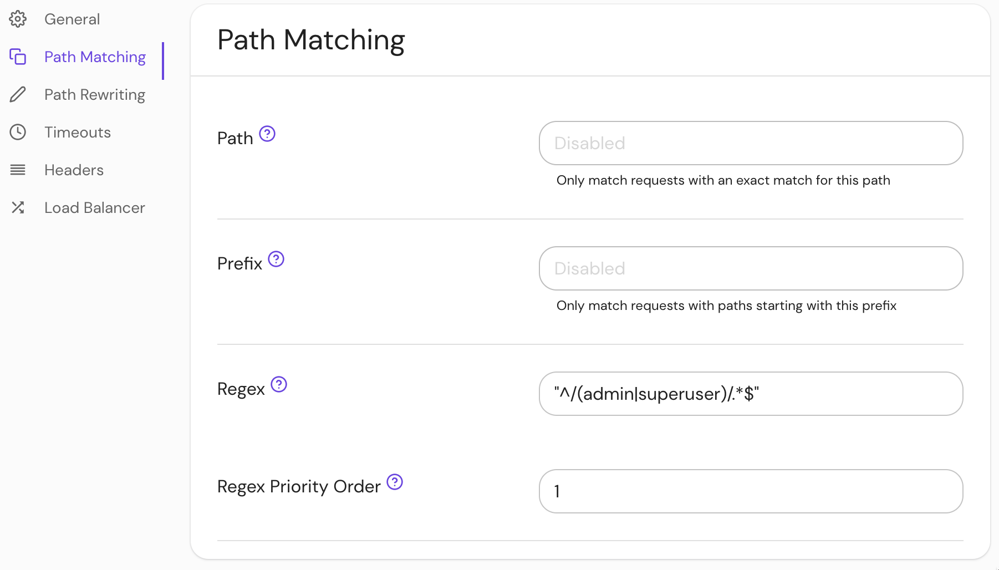

import Tabs from '@theme/Tabs';
import TabItem from '@theme/TabItem';

# Regex Priority Order

## Summary

If **Regex Priority Order** is set, the route will only match incoming requests with a path that matches the specified regular expression. The supported syntax is the same as the Go [regexp package](https://golang.org/pkg/regexp/) which is based on [re2](https://github.com/google/re2/wiki/Syntax).

## How to configure

<Tabs>
<TabItem value="Core" label="Core">

| **YAML**/**JSON** setting | **Type** | **Usage**    |
| :------------------------ | :------- | :----------- |
| `regex_priority_order`    | `uint32` | **optional** |

</TabItem>
<TabItem value="Enterprise" label="Enterprise">

Set **Regex Priority Order** in the Console:

1. Enter a regular expression in the **Regex** field
2. Enter the **Regex Priority Order**



</TabItem>
<TabItem value="Kubernetes" label="Kubernetes">

Kubernetes does not support **Regex Priority Order**

</TabItem>
</Tabs>

### Examples

```yaml
regex: '^/(admin|superuser)/.*$'
regex_priority_order: 1
```
