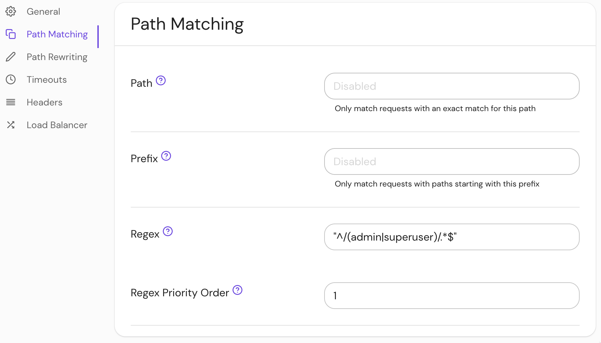

import TabItem from '@theme/TabItem';
import Tabs from '@theme/Tabs';

import EnterpriseConfiguration from '../../../../src/components/EnterpriseConfiguration';

# Regex Priority Order

## Summary

**Regex Priority Order** determines the ordering of routes that use `regex` matching. Higher values are evaluated first.

## How to configure

<Tabs>
<TabItem value="Core" label="Core">

| **YAML**/**JSON** setting | **Type** | **Usage**    |
| :------------------------ | :------- | :----------- |
| `regex_priority_order`    | `int64`  | **optional** |

### Examples

```yaml
regex: '^/(admin|superuser)/.*$'
regex_priority_order: 1
```

</TabItem>
<TabItem value="Enterprise" label="Enterprise">
<EnterpriseConfiguration name="regex_priority_order" resource="route">

Set **Regex Priority Order** in the Console:

1. Enter a regular expression in the **Regex** field
2. Enter the **Regex Priority Order**



</EnterpriseConfiguration>
</TabItem>
<TabItem value="Kubernetes" label="Kubernetes">

Kubernetes does not support **Regex Priority Order**

</TabItem>
</Tabs>
