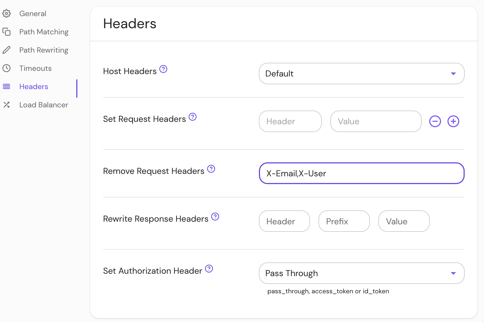

import Tabs from '@theme/Tabs';
import TabItem from '@theme/TabItem';

# Remove Request Headers

## Summary

**Remove Request Headers** allows you to remove given request headers. This can be useful if you want to prevent privacy information from being passed to downstream applications.

## How to configure

| **Type** | **Usage**    |
| :------- | :----------- |
| `string` | **optional** |

<Tabs>
<TabItem value="Core" label="Core">

| **YAML**/**JSON** setting |
| :------------------------ |
| `remove_request_headers`  |

</TabItem>
<TabItem value="Enterprise" label="Enterprise">

Set **Remove Request Headers** in the Console:



</TabItem>
<TabItem value="Kubernetes" label="Kubernetes">

| **Name**                 |
| :----------------------- |
| `remove_request_headers` |

See Kubernetes [Ingress](/docs/deploy/k8s/ingress#annotations) for more information

</TabItem>
</Tabs>

### Examples

```yaml
- from: https://verify.corp.example.com
  to: https://verify.pomerium.com
  policy:
    - allow:
        or:
          - email:
              is: user@example.com
  remove_request_headers:
    - X-Email
    - X-Username

# ingress
ingress.pomerium.io/remove_request_headers: |
  - X-Email
  - X-User
```
