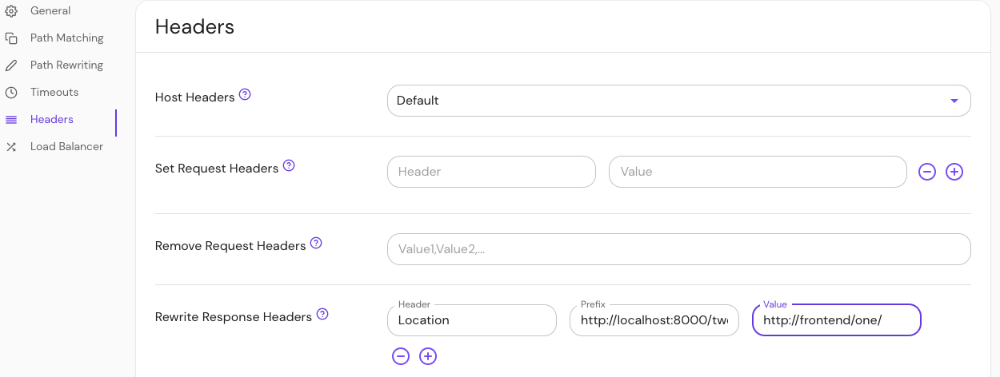

import Tabs from '@theme/Tabs';
import TabItem from '@theme/TabItem';

# Rewrite Response Headers

## Summary

**Rewrite Response Headers** allows you to modify response headers before they are returned to the client. The `header` field will match the HTTP header name, and `prefix` will be replaced with `value`.

## How to configure

<Tabs>
<TabItem value="Core" label="Core">

| **YAML**/**JSON** setting  | **Type** | **Usage**    |
| :------------------------- | :------- | :----------- |
| `rewrite_response_headers` | `object` | **optional** |

</TabItem>
<TabItem value="Enterprise" label="Enterprise">

Configure **Rewrite Response Headers** in the Console:



</TabItem>
<TabItem value="Kubernetes" label="Kubernetes">

| **Name**                   | **Type** | **Usage**    |
| :------------------------- | :------- | :----------- |
| `rewrite_response_headers` | `object` | **optional** |

See Kubernetes [Ingress](/docs/deploy/k8s/ingress#annotations) for more information

</TabItem>
</Tabs>

### Examples

If the downstream server returns a header:

```text
Location: http://localhost:8000/two/some/path/
```

And the policy has this config:

```yaml
rewrite_response_headers:
  - header: Location
    prefix: http://localhost:8000/two/
    value: http://frontend/one/
```

The browser would be redirected to: `http://frontend/one/some/path/`. This is similar to nginx's [`proxy_redirect` option](http://nginx.org/en/docs/http/ngx_http_proxy_module.html#proxy_redirect), but can be used for any header.
