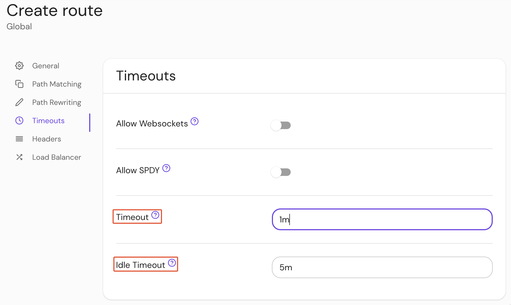

import Tabs from '@theme/Tabs';
import TabItem from '@theme/TabItem';

# Route Timeout

## Summary

**Route Timeout** establishes the per-route timeout value. Cannot exceed [global timeout](/docs/reference/global-timeouts) values.

## How to configure

| **Type** | **Usage** | **Default** |
| :-- | :-- | :-- |
| `string` ([Go Duration](https://golang.org/pkg/time/#Duration.String) formatting) | **optional** | `30s` |

<Tabs>
<TabItem value="Core" label="Core">

| **YAML**/**JSON** setting |
| :------------------------ |
| `timeout`                 |

</TabItem>
<TabItem value="Enterprise" label="Enterprise">

Set the **Route Timeout** in the Console:



</TabItem>
<TabItem value="Kubernetes" label="Kubernetes">

| **Name**  |
| :-------- |
| `timeout` |

See Kubernetes [Ingress](/docs/deploy/k8s/ingress#annotations) for more information

</TabItem>
</Tabs>

### Examples

```yaml
timeout: 30s
```
