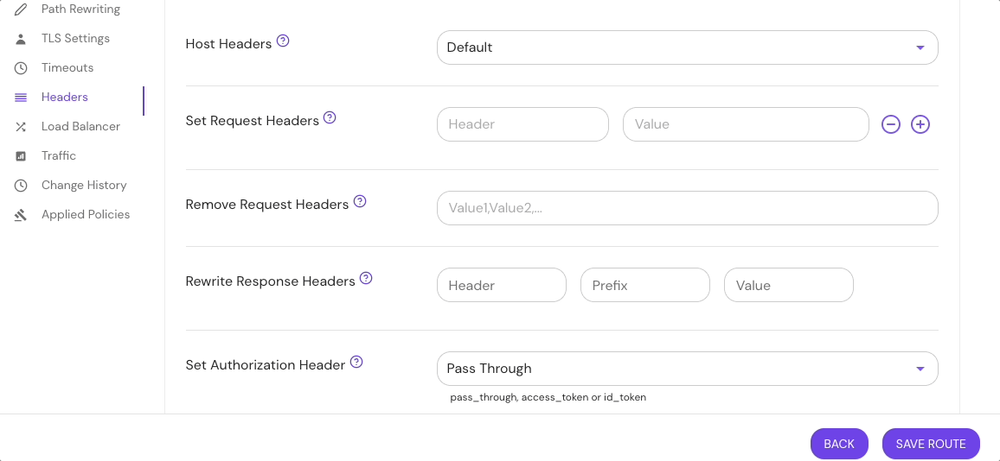

import Tabs from '@theme/Tabs';
import TabItem from '@theme/TabItem';

# Set Authorization Header

## Summary

**Set Authorization Header** allows you to send a user's identity token through as a bearer token in the Authorization header.

## How to configure

| **Type** | **Default**    | **Usage**    |
| :------- | :------------- | :----------- |
| `string` | `pass_through` | **optional** |

Use `access_token` to send the OAuth access token, `id_token` to send the OIDC ID token, or `pass_through` (the default) to leave the Authorization header unchanged from the client when it's not used for Pomerium authentication.

<Tabs>
<TabItem value="Core" label="Core">

| **YAML**/**JSON** setting  |
| :------------------------- |
| `set_authorization_header` |

</TabItem>
<TabItem value="Enterprise" label="Enterprise">

Configure **Set Authorization Header** in the Console:



</TabItem>
<TabItem value="Kubernetes" label="Kubernetes">

Kubernetes does not support **Set Authorization Header**

</TabItem>
</Tabs>

### Examples

```yaml
set_authorization_header: pass_through
```
