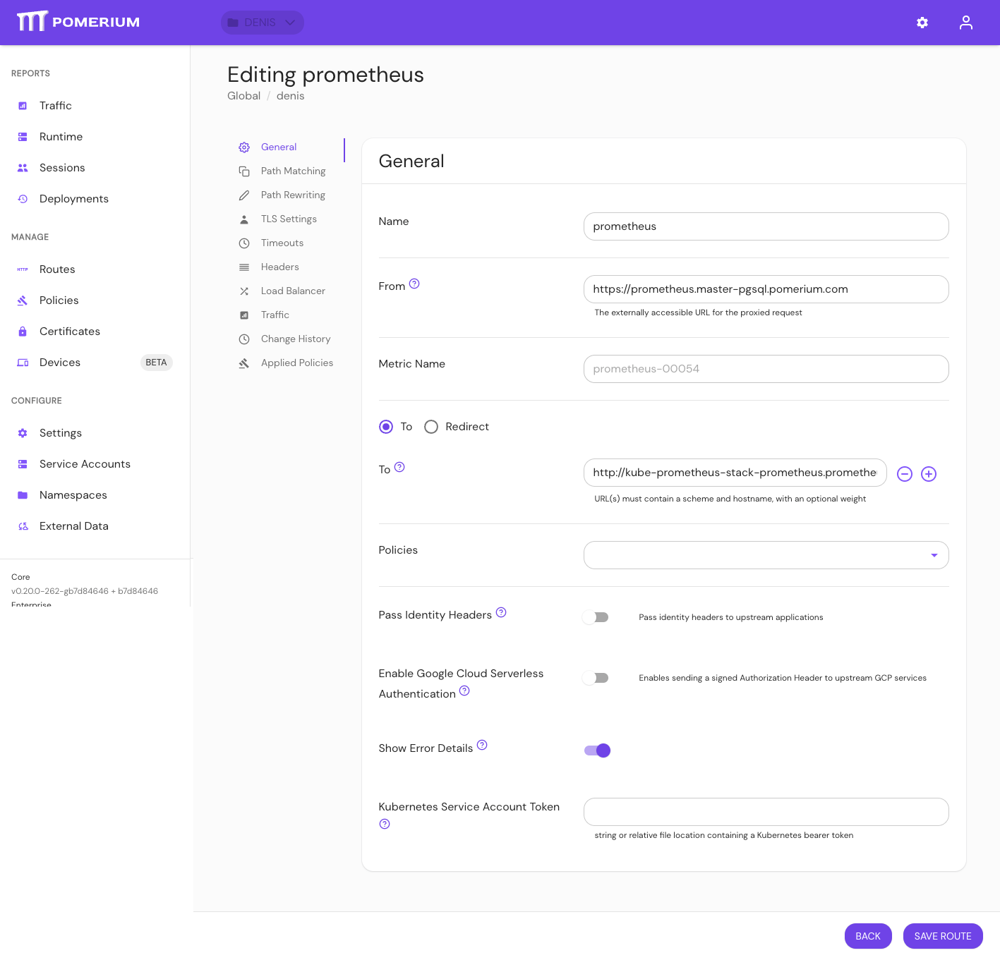

import Tabs from '@theme/Tabs';
import TabItem from '@theme/TabItem';

# Show Error Details

## Summary

If true, **Show Error Details** allows you apply your custom [error message header](/docs/reference/branding/error-message-header) to a route.

## How to configure

| **Type**  | **Default** |
| :-------- | :---------- |
| `boolean` | `false`     |

### Examples

Enable **Show Error Details** on a route in the Console:

