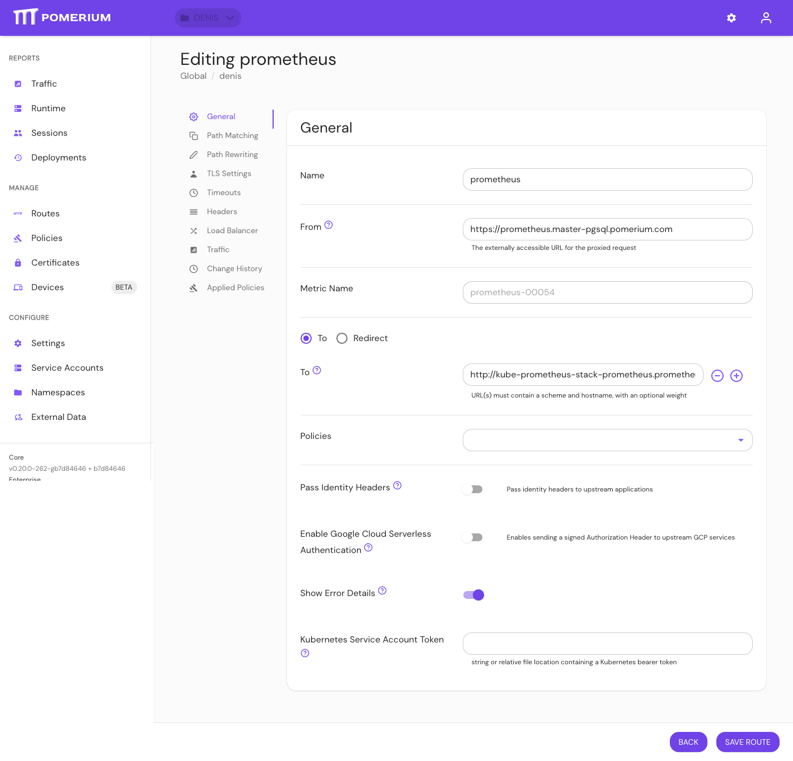

import TabItem from '@theme/TabItem';
import Tabs from '@theme/Tabs';

import EnterpriseConfiguration from '../../../../src/components/EnterpriseConfiguration';

# Show Error Details

## Summary

If enabled, **Show Error Details** includes policy evaluation explanation and remediation details in authorization error responses.

## How to configure

<Tabs>
<TabItem value="Core" label="Core">

| **Config file keys** | **Type**  | **Usage**    | **Default** |
| :------------------- | :-------- | :----------- | :---------- |
| `show_error_details` | `boolean` | **optional** | `false`     |

### Examples

```yaml
routes:
  - from: https://example.com
    to: https://upstream.internal
    show_error_details: true
```

</TabItem>
<TabItem value="Enterprise" label="Enterprise">
<EnterpriseConfiguration name="show_error_details" resource="route">

Enable **Show Error Details** on a route in the Console:



</EnterpriseConfiguration>
</TabItem>
<TabItem value="Kubernetes" label="Kubernetes">

Kubernetes does not support `show_error_details`

</TabItem>
</Tabs>
