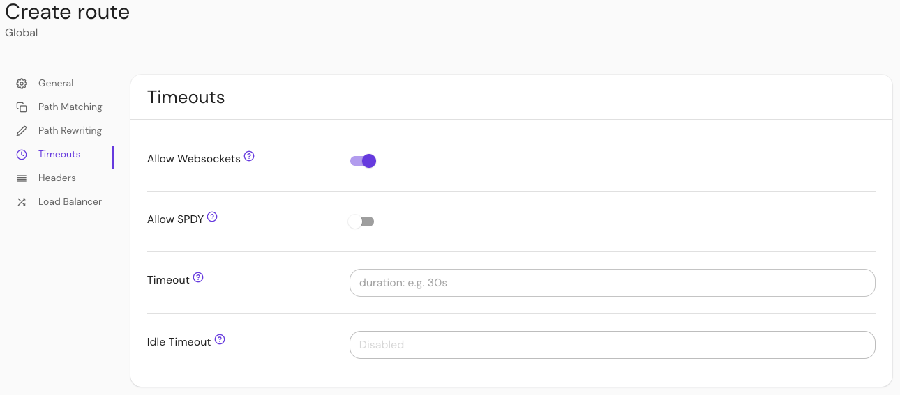

import Tabs from '@theme/Tabs';
import TabItem from '@theme/TabItem';

# Timeouts Settings

This reference covers all of Pomerium's **Timeouts Settings**:

- [Allow Websockets](#websocket-connections)
- [SPDY](#spdy)
- [Route Timeout](#route-timeout)
- [Idle Timeout](#idle-timeout)

## Websocket Connections {#websocket-connections}

If set, enables proxying of websocket connections.

:::warning

**Use with caution:** websockets are long-lived connections, so [global timeouts](/docs/reference/global-timeouts) are not enforced (though the policy-specific `timeout` is enforced). Allowing websocket connections to the proxy could result in abuse via [DOS attacks](https://www.cloudflare.com/learning/ddos/ddos-attack-tools/slowloris/).

:::

### How to configure {#how-to-configure-websocket-connections}

<Tabs>
<TabItem value="Core" label="Core">

| **YAML**/**JSON** setting | **Type**  | **Default** |
| :------------------------ | :-------- | :---------- |
| `allow_websockets`        | `boolean` | `false`     |

### Examples {#examples-websocket-connections}

```yaml
allow_websockets: true
```

</TabItem>
<TabItem value="Enterprise" label="Enterprise">

Enable **Allow Websockets** in the Console:



</TabItem>
<TabItem value="Kubernetes" label="Kubernetes">

| **annotation**     | **Type**            | **Default** |
| :----------------- | :------------------ | :---------- |
| `allow_websockets` | `boolean`, `string` | `false`     |

### Examples

```yaml
ingress.pomerium.io/allow_websockets: 'true'
```

See Kubernetes [Ingress](/docs/deploy/k8s/ingress#annotations) for more information

</TabItem>
</Tabs>

## SPDY {#spdy}

If set, **SPDY** enables proxying of SPDY protocol upgrades.

### How to configure {#how-to-configure-spdy}

<Tabs>
<TabItem value="Core" label="Core">

| **YAML**/**JSON** setting | **Type**  | **Default** |
| :------------------------ | :-------- | :---------- |
| `allow_spdy`              | `boolean` | `false`     |

### Examples {#examples-spdy}

```YAML
allow_spdy: true
```

</TabItem>
<TabItem value="Enterprise" label="Enterprise">

Enable **SPDY** in the Console:


</TabItem>
<TabItem value="Kubernetes" label="Kubernetes">

| **Name**     | **Type**  | **Default** |
| :----------- | :-------- | :---------- |
| `allow_spdy` | `boolean` | `false`     |

### Examples

```yaml
ingress.pomerium.io/allow_spdy: 'true'
```

See Kubernetes [Ingress](/docs/deploy/k8s/ingress#annotations) for information

</TabItem>
</Tabs>

## Route Timeout {#route-timeout}

**Route Timeout** establishes the per-route timeout value. Cannot exceed [global timeout](/docs/reference/global-timeouts) values.

### How to configure {#how-to-configure-route-timeout}

<Tabs>
<TabItem value="Core" label="Core">

| **YAML**/**JSON** setting | **Type** | **Usage** | **Default** |
| :-- | :-- | :-- | :-- |
| `timeout` | `string` ([Go Duration](https://golang.org/pkg/time/#Duration.String) formatting) | **optional** | `30s` |

### Examples {#examples-route-timeout}

```yaml
timeout: 30s
```

</TabItem>
<TabItem value="Enterprise" label="Enterprise">

Set the **Route Timeout** in the Console:


</TabItem>
<TabItem value="Kubernetes" label="Kubernetes">

| **Name** | **Type** | **Usage** | **Default** |
| :-- | :-- | :-- | :-- |
| `timeout` | `string` ([Go Duration](https://golang.org/pkg/time/#Duration.String) formatting) | **optional** | `30s` |

### Examples

```yaml
ingress.pomerium.io/timeout: '30s'
```

See Kubernetes [Ingress](/docs/deploy/k8s/ingress#annotations) for more information

</TabItem>
</Tabs>

## Idle Timeout {#idle-timeout}

If you are proxying long-lived requests that employ streaming calls such as websockets or gRPC, set **Idle Timeout** to either a maximum value there may be no data exchange over a connection (recommended), or set it to unlimited (`0s`).

If `idle_timeout` is specified, and [route timeout](/docs/reference/routes/timeouts#route-timeout) is not explicitly set, then the route timeout would be unlimited (`0s`). You still may specify maximum lifetime of the connection using the route timeout value (i.e. to 1 day).

### How to configure {#how-to-configure-idle-timeout}

<Tabs>
<TabItem value="Core" label="Core">

| **YAML**/**JSON** setting | **Type** | **Usage** | **Default** |
| :-- | :-- | :-- | :-- |
| `idle_timeout` | `string` ([Go Duration](https://golang.org/pkg/time/#Duration.String) formatting) | **optional** | `5m` |

### Examples

```yaml
routes:
  - from: https://verify.localhost.pomerium.io
    to: http://verify:8000
    timeout: 1m
    idle_timeout: 5m
```

</TabItem>
<TabItem value="Enterprise" label="Enterprise">

Set **Idle Timeout** under route **Timeouts** settings in the Console:


</TabItem>
<TabItem value="Kubernetes" label="Kubernetes">

| **Annotation name** | **Type** | **Usage** | **Default** |
| :-- | :-- | :-- | :-- |
| `idle_timeout` | `string` ([Go Duration](https://golang.org/pkg/time/#Duration.String) formatting) | **optional** | `5m` |

### Examples

```yaml
ingress.pomerium.io/timeout: '1m'
ingress.pomerium.io/idle_timeout: '5m'
```

See the Kubernetes [Ingress - Pomerium Standard Annotations](/docs/deploy/k8s/ingress) section for more information.

</TabItem>
</Tabs>
