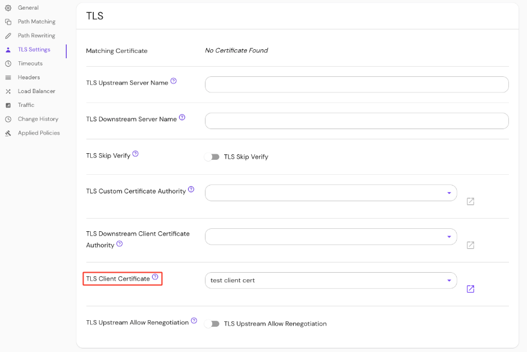

import Tabs from '@theme/Tabs';
import TabItem from '@theme/TabItem';

# TLS Client Certificate

## Summary

If specified, Pomerium will present this client certificate to upstream services when requested to enforce [mutual authentication](https://en.wikipedia.org/wiki/Mutual_authentication) (mTLS).

For more details, see our [mTLS example repository](https://github.com/pomerium/pomerium/tree/main/examples/mutual-tls) and the [Upstream mTLS With Pomerium](/docs/capabilities/mtls-services) guide.

## How to configure

| **Type**                  | **Usage**    |
| :------------------------ | :----------- |
| `string` (base64-encoded) | **optional** |

<Tabs>
<TabItem value="Core" label="Core">

| **YAML**/**JSON** setting                        |
| :----------------------------------------------- |
| `tls_client_cert` and `tls_client_key`           |
| `tls_client_cert_file` and `tls_client_key_file` |

</TabItem>
<TabItem value="Enterprise" label="Enterprise">

Set the **TLS Client Certificate** under **TLS Settings** in the Console:



</TabItem>
<TabItem value="Kubernetes" label="Kubernetes">

See Kubernetes [TLS Certificates](/docs/deploying/k8s/ingress#tls-certificates) for more information

</TabItem>
</Tabs>

### Examples

```yaml
tls_client_cert: base64-encoded-certificate
tls_client_key: base64-encoded-keywords

# or
tls_client_cert_file: /relative/file/location
tls_client_key_file: /relative/file/location
```
