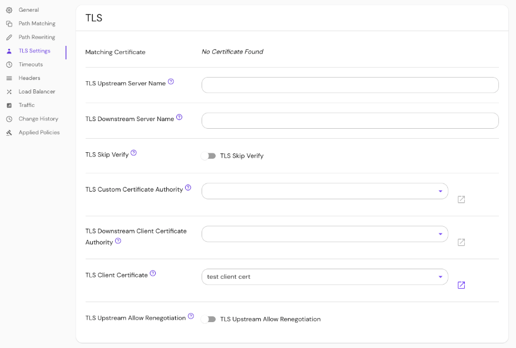

import Tabs from '@theme/Tabs';
import TabItem from '@theme/TabItem';

# TLS Custom Certificate Authority

## Summary

**TLS Custom Certificate Authority** defines a set of root certificate authorities that the Pomerium Proxy Service uses when verifying upstream server certificates.

**Note**: This setting will replace (not append) the system's trust store for a given route.

## How to configure

| **Type** | **Usage**    |
| :------- | :----------- |
| `string` | **optional** |

<Tabs>
<TabItem value="Core" label="Core">

| **YAML**/**JSON** setting               |
| :-------------------------------------- |
| `tls_custom_ca` or `tls_custom_ca_file` |

</TabItem>
<TabItem value="Enterprise" label="Enterprise">

Set **TLS Custom Certificate Authority** in the Console:



</TabItem>
<TabItem value="Kubernetes" label="Kubernetes">

See Kubernetes [TLS Certificates](/docs/deploying/k8s/ingress#tls-certificates) for more information

</TabItem>
</Tabs>

### Examples

```yaml
tls_custom_ca: base64-encoded-custom-ca
tls_custom_ca_file: /relative/file/location
```
