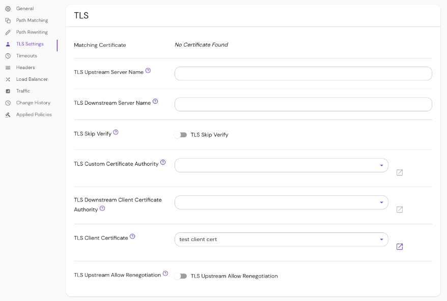

import Tabs from '@theme/Tabs';
import TabItem from '@theme/TabItem';

# TLS Downstream Client Certificate Authority

## Summary

If specified, downstream clients (like a user's browser) will be required to provide a valid client TLS certificate. This overrides the global `client_ca` option for this route.

See [Client-Side mTLS With Pomerium](/docs/concepts/mutual-auth.md) for more information.

## How to configure

<Tabs>
<TabItem value="Core" label="Core">

| **YAML**/**JSON** setting | **Type** | **Usage** |
| :-- | :-- | :-- |
| `tls_downstream_client_ca` or `tls_downstream_client_ca_file` | `string` | **optional** |

</TabItem>
<TabItem value="Enterprise" label="Enterprise">

Set **TLS Downstream Client CA** in the Console:



</TabItem>
<TabItem value="Kubernetes" label="Kubernetes">

See Kubernetes [TLS Certificates](/docs/deploy/k8s/ingress#tls-certificates) for more information

</TabItem>
</Tabs>

### Examples

```yaml
tls_downstream_client_ca: base64-encoded-client-ca
tls_downstream_client_ca_file: /relative/file/location
```
