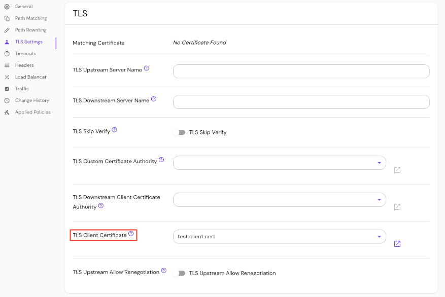

import Tabs from '@theme/Tabs';
import TabItem from '@theme/TabItem';

# TLS Settings

This reference covers all of Pomerium's TLS route settings:

- [TLS Client Certificate](#tls-client-certificate)
- [TLS Custom Certificate Authority](#tls-custom-certificate-authority)
- [TLS Downstream Client Certificate Authority](#tls-downstream-client-certificate-authority)
- [TLS Downstream Server Name](#tls-downstream-server-name)
- [TLS Skip Verification](#tls-skip-verification)
- [TLS Upstream Allow Renegotiation](#tls-upstream-allow-renegotiation)
- [TLS Upstream Server Name](#tls-upstream-server-name)

## TLS Client Certificate {#tls-client-certificate}

If specified, Pomerium will present this client certificate to upstream services when requested to enforce [mutual authentication](https://en.wikipedia.org/wiki/Mutual_authentication) (mTLS).

For more details, see our [mTLS example repository](https://github.com/pomerium/pomerium/tree/main/examples/mutual-tls) and the [Upstream mTLS With Pomerium](/docs/capabilities/mtls-services) guide.

### How to configure {#how-to-configure-tls-client-certificate}

<Tabs>
<TabItem value="Core" label="Core">

| **YAML**/**JSON** setting | **Type** | **Usage** |
| :-- | :-- | :-- |
| `tls_client_cert` and `tls_client_key` | `string` (base64-encoded) | **optional** |
| `tls_client_cert_file` and `tls_client_key_file` | `string` (base64-encoded) | **optional** |

### Examples {#examples-tls-client-certificate}

```yaml
tls_client_cert: base64-encoded-certificate
tls_client_key: base64-encoded-keywords

# or
tls_client_cert_file: /relative/file/location
tls_client_key_file: /relative/file/location
```

</TabItem>
<TabItem value="Enterprise" label="Enterprise">

Set the **TLS Client Certificate** under **TLS Settings** in the Console:



</TabItem>
<TabItem value="Kubernetes" label="Kubernetes">

See Kubernetes [TLS Certificates](/docs/deploy/k8s/ingress#tls-certificates) for more information

</TabItem>
</Tabs>

## TLS Custom Certificate Authority {#tls-custom-certificate-authority}

**TLS Custom Certificate Authority** defines a set of root certificate authorities that the Pomerium Proxy Service uses when verifying upstream server certificates.

**Note**: This setting will replace (not append) the system's trust store for a given route.

### How to configure {#how-to-configure-tls-custom-certificate-authority}

<Tabs>
<TabItem value="Core" label="Core">

| **YAML**/**JSON** setting               | **Type** | **Usage**    |
| :-------------------------------------- | :------- | :----------- |
| `tls_custom_ca` or `tls_custom_ca_file` | `string` | **optional** |

### Examples {#examples-tls-custom-certificate-authority}

```yaml
tls_custom_ca: base64-encoded-custom-ca
tls_custom_ca_file: /relative/file/location
```

</TabItem>
<TabItem value="Enterprise" label="Enterprise">

Set **TLS Custom Certificate Authority** in the Console:


</TabItem>
<TabItem value="Kubernetes" label="Kubernetes">

See Kubernetes [TLS Certificates](/docs/deploy/k8s/ingress#tls-certificates) for more information

</TabItem>
</Tabs>

## TLS Downstream Client Certificate Authority {#tls-downstream-client-certificate-authority}

:::caution

This setting is deprecated, and will be removed in a future release.

If you previously used this setting to require client certificates only on certain routes, you can achieve this same behavior by setting the new downstream mTLS [**Enforcement Mode**](/docs/reference/downstream-mtls-settings#enforcement-mode) option to the value `policy` and adding a policy deny rule with the `invalid_client_certificate` criterion on all routes that should require client certificates.

If you want to enforce an allowlist or denylist of specific certificates on a particular route, you can use the new [`client_certificate`](/docs/capabilities/ppl#certificate-matcher) policy criterion.

If you do need to set completely different trusted client CAs for different routes, we recommend running separate Pomerium clusters for each set of trusted client CAs.

:::

If specified, downstream clients (like a user's browser) will be required to provide a valid client TLS certificate. This overrides the global `downstream_mtls.ca` option for this route.

See [Client-Side mTLS With Pomerium](/docs/concepts/mutual-auth.md) for more information.

### How to configure {#how-to-configure-tls-downstream-client-certificate-authority}

<Tabs>
<TabItem value="Core" label="Core">

| **YAML**/**JSON** setting | **Type** | **Usage** |
| :-- | :-- | :-- |
| `tls_downstream_client_ca` or `tls_downstream_client_ca_file` | `string` | **optional** |

### Examples {#examples-tls-downstream-client-certificate-authority}

```yaml
tls_downstream_client_ca: base64-encoded-client-ca
tls_downstream_client_ca_file: /relative/file/location
```

</TabItem>
<TabItem value="Enterprise" label="Enterprise">

Set **TLS Downstream Client CA** in the Console:


</TabItem>
<TabItem value="Kubernetes" label="Kubernetes">

See Kubernetes [TLS Certificates](/docs/deploy/k8s/ingress#tls-certificates) for more information

</TabItem>
</Tabs>

## TLS Downstream Server Name {#tls-downstream-server-name}

**TLS Downstream Server Name** overrides the hostname specified in the `from` field. When a connection to Pomerium is made via TLS the `tls_downstream_server_name` will be used as the expected Server Name Indication, whereas the host part of the `from` field, will be expected to match the `Host` or `:authority` headers of the HTTP request.

### How to configure {#how-to-configure-tls-downstream-server-name}

<Tabs>
<TabItem value="Core" label="Core">

| **Config file keys** | **Environment variables** | **Type** | **Usage** |
| :-- | :-- | :-- | :-- |
| `tls_downstream_server_name` | `TLS_DOWNSTREAM_SERVER_NAME` | `string` | **optional** |

</TabItem>
<TabItem value="Enterprise" label="Enterprise">

Set **TLS Downstream Server Name** in the Console:


</TabItem>
<TabItem value="Kubernetes" label="Kubernetes">

Kubernetes does not support `tls_downstream_server_name`

</TabItem>
</Tabs>

## TLS Skip Verification {#tls-skip-verification}

TLS Skip Verification controls whether the Pomerium Proxy Service verifies the upstream server's certificate chain and host name.

If enabled, Pomerium accepts any certificate presented by the upstream server and any host name in that certificate.

In this mode, TLS is susceptible to man-in-the-middle attacks. This should be used only for testing.

### How to configure {#how-to-configure-tls-skip-verification}

<Tabs>
<TabItem value="Core" label="Core">

| **YAML**/**JSON** setting | **Type**  | **Default** |
| :------------------------ | :-------- | :---------- |
| `tls_skip_verify`         | `boolean` | `false`     |

### Examples {#examples-tls-skip-verification}

```yaml
tls_skip_verify: true
```

</TabItem>
<TabItem value="Enterprise" label="Enterprise">

Enable **TLS Skip Verify** in the Console:


</TabItem>
<TabItem value="Kubernetes" label="Kubernetes">

| **[Annotation name](/docs/deploy/k8s/ingress#set-ingress-annotations)** | **Type** | **Default** |
| :-- | :-- | :-- |
| `tls_skip_verify` | `boolean` | `false` |

### Examples

```yaml
ingress.pomerium.io/tls_skip_verify: 'true'
```

</TabItem>
</Tabs>

## TLS Upstream Allow Renegotiation {#tls-upstream-allow-renegotiation}

**TLS Upstream Allow Renegotiation** controls whether server-initiated TLS renegotiation is allowed for upstream servers. For more details, see Envoy's documentation on [`allow_renegotiation`](https://www.envoyproxy.io/docs/envoy/latest/api-v3/extensions/transport_sockets/tls/v3/tls.proto).

:::warning

TLS renegotiation is considered insecure and shouldn’t be used unless absolutely necessary.

:::

### How to configure {#how-to-configure-tls-upstream-allow-renegotiation}

<Tabs>
<TabItem value="Core" label="Core">

| **YAML**/**JSON** setting          | **Type**  | **Default** |
| :--------------------------------- | :-------- | :---------- |
| `tls_upstream_allow_renegotiation` | `boolean` | `false`     |

### Examples {#examples-tls-upstream-allow-renegotiation}

```yaml
tls_upstream_allow_renegotiation: true
```

</TabItem>
<TabItem value="Enterprise" label="Enterprise">

Enable **TLS Upstream Allow Renegotiation** in the Console:


</TabItem>
<TabItem value="Kubernetes" label="Kubernetes">

Kubernetes does not support **TLS Upstream Allow Renegotiation**

</TabItem>
</Tabs>

## TLS Upstream Server Name {#tls-upstream-server-name}

**TLS Upstream Server Name** overrides the hostname specified in the `to` field. If set, this server name will be used to verify the certificate name. This is useful when the backend of your service is a TLS server with a valid certificate, but mismatched name.

### How to configure {#how-to-configure-tls-upstream-server-name}

<Tabs>
<TabItem value="Core" label="Core">

| **Config file keys** | **Environment variables** | **Type** | **Usage** |
| :-- | :-- | :-- | :-- |
| `tls_upstream_server_name` | `TLS_UPSTREAM_SERVER_NAME` | `string` | **optional** |

</TabItem>
<TabItem value="Enterprise" label="Enterprise">

Set **TLS Upstream Server Name** in the Console:


</TabItem>
<TabItem value="Kubernetes" label="Kubernetes">

Kubernetes does not support `tls_upstream_server_name`

</TabItem>
</Tabs>
