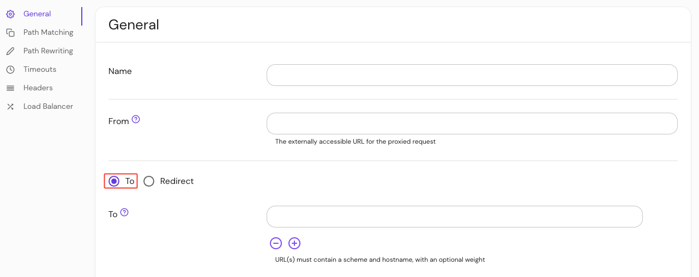

import Tabs from '@theme/Tabs';
import TabItem from '@theme/TabItem';

# To

## Summary

**To** is the destination(s) of a proxied request. It can be an internal resource, or an external resource.

## How to configure

<Tabs>
<TabItem value="Core" label="Core">

| **YAML**/**JSON** setting | **Type** | **Usage**    | **Schemes**            |
| :------------------------ | :------- | :----------- | :--------------------- |
| `to`                      | `URL`    | **optional** | `http`, `https`, `tcp` |

### Examples

```yaml
- from: https://example.com
  to: http://verify

- from: https://example.com
  to: https://192.1.20.12:8080

- from: https://example.com
  to: http://neverssl.com

- from: https://example.com
  to: https://verify.pomerium.com/anything/
```

</TabItem>
<TabItem value="Enterprise" label="Enterprise">

Set **To** in the Console:



</TabItem>
<TabItem value="Kubernetes" label="Kubernetes">

See Kubernetes [Ingress](/docs/deploy/k8s/ingress) for more information.

</TabItem>
</Tabs>

### Target multiple upstream resources

Multiple upstream resources can be targeted by using a list instead of a single URL:

```yaml
- from: https://example.com
  to:
    - https://a.example.com
    - https://b.example.com
```

### Set load balancing weight

A load balancing weight may be associated with a particular upstream by appending `,[weight]` to the URL. The exact behavior depends on your [`lb_policy`](/docs/reference/routes/load-balancing#load-balancing-policy) setting. See [Load Balancing](@site/content/docs/capabilities/load-balancing.md) for example [configurations](@site/content/docs/capabilities/load-balancing.md#load-balancing-weight).

```yaml
- from: https://example.com
  to: ['http://a', 'http://b']

- from: https://example.com
  to: ['http://a,10', 'http://b,20']
```

### TCP routes

You can configure Pomerium to handle a [TCP route](/docs/capabilities/tcp) in one of two different ways.

If you specify a `to` URL with the `tcp://` scheme, Pomerium will proxy the raw TCP connection to the upstream service:

```yaml
- from: tcp+https://tcp.example.com:3001
  to: tcp://localhost:3001
```

Configure Pomerium to proxy the TCP connection request to the upstream service by specifying either the `http://` or `https://` scheme in the `to` URL:

```yaml
- from: tcp+https://tcp.example.com:3001
  to: http://second-proxy.tcp.example.com:3002
```

See the [TCP docs](/docs/capabilities/tcp) for information about building TCP routes and other advanced TCP features.

:::note

See [**Routing - Route matching order**](/docs/capabilities/routing#route-matching-order) for more information on how Pomerium processes and matches routes.

:::

:::warning

Be careful with trailing slash.

With rule:

```yaml
- from: https://verify.corp.example.com
  to: https://verify.pomerium.com/anything
```

Requests to `https://verify.corp.example.com` will be forwarded to `https://verify.pomerium.com/anything`, while requests to `https://verify.corp.example.com/foo` will be forwarded to `https://verify.pomerium.com/anythingfoo`.To make the request forwarded to `https://httbin.org/anything/foo`, you can use double slashes in your request `https://httbin.corp.example.com//foo`.

While the rule:

```yaml
- from: https://verify.corp.example.com
  to: https://verify.pomerium.com/anything/
```

All requests to `https://verify.corp.example.com/*` will be forwarded to `https://verify.pomerium.com/anything/*`. That means accessing to `https://verify.corp.example.com` will be forwarded to `https://verify.pomerium.com/anything/`. That said, if your application does not handle trailing slash, the request will end up with 404 not found.

Either `redirect` or `to` must be set.

:::
