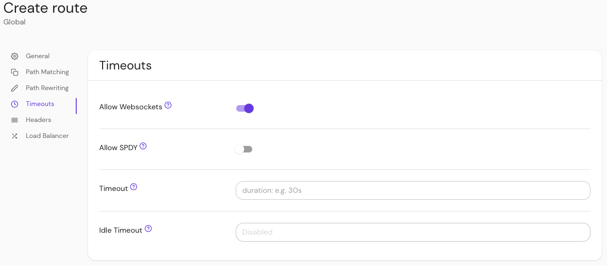

import Tabs from '@theme/Tabs';
import TabItem from '@theme/TabItem';

# Websocket Connections

## Summary

If set, enables proxying of websocket connections.

:::warning

**Use with caution:** websockets are long-lived connections, so [global timeouts](/docs/reference/global-timeouts) are not enforced (though the policy-specific `timeout` is enforced). Allowing websocket connections to the proxy could result in abuse via [DOS attacks](https://www.cloudflare.com/learning/ddos/ddos-attack-tools/slowloris/).

:::

## How to configure

| **Type**  | **Default** |
| :-------- | :---------- |
| `boolean` | `false`     |

<Tabs>
<TabItem value="Core" label="Core">

| **YAML**/**JSON** setting |
| :------------------------ |
| `allow_websockets`        |

</TabItem>
<TabItem value="Enterprise" label="Enterprise">

Enable **Allow Websockets** in the Console:



</TabItem>
<TabItem value="Kubernetes" label="Kubernetes">

| **Name**           |
| :----------------- |
| `allow_websockets` |

See Kubernetes [Ingress](/docs/deploying/k8s/ingress#annotations) for more information

</TabItem>
</Tabs>

### Examples

```yaml
allow_websockets: true
```
