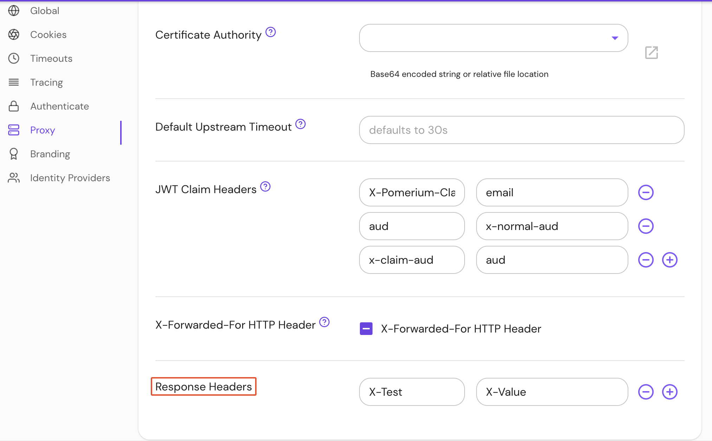

import Tabs from '@theme/Tabs';
import TabItem from '@theme/TabItem';

# Set Response Headers

## Summary

**Set Response Headers** specifies a mapping of [HTTP Headers](https://developer.mozilla.org/en-US/docs/Web/HTTP/Headers) to be added globally to all managed routes and Pomerium's Authenticate Service.

## How to configure

<Tabs>
<TabItem value="Core" label="Core">

| **Config file keys** | **Environment variables** | **Type** | **Default** |
| :-- | :-- | :-- | :-- |
| `set_response_headers` | `SET_RESPONSE_HEADERS` | `string` | see [Default headers](#default) |

### Examples

#### JSON

```json
{
  "set_response_headers": {
    "X-Test": "X-Value"
  }
}
```

#### YAML

```yaml
set_response_headers:
  X-Test: X-Value
```

</TabItem>
<TabItem value="Enterprise" label="Enterprise">

Configure **Response Headers** under **Proxy** settings in the Console:



</TabItem>
<TabItem value="Kubernetes" label="Kubernetes">

| **Annotation name**    | **Type** | **Default**                     |
| :--------------------- | :------- | :------------------------------ |
| `set_response_headers` | `string` | see [Default headers](#default) |

### Examples

```yaml
ingress.pomerium.io/set_response_headers: |
  X-Test: X-Value
```

See [Kubernetes - Ingress Configuration](/docs/deploy/k8s/ingress) for more information.

</TabItem>
</Tabs>

### Default headers

```headers
X-Content-Type-Options : nosniff,
X-Frame-Options:SAMEORIGIN,
X-XSS-Protection:1; mode=block,
Strict-Transport-Security:max-age=31536000; includeSubDomains; preload,
```

By default, conservative [secure HTTP headers](https://www.owasp.org/index.php/OWASP_Secure_Headers_Project) are set:

- `max-age=31536000` instructs the browser to pin the certificate for a domain for a year. This helps prevent man-in-the-middle attacks, but can create issues when developing new environments with temporary certificates. See [Troubleshooting - HSTS](/docs/internals/troubleshooting#http-strict-transport-security-hsts) for more information.
- `includeSubDomains` applies these rules to subdomains, which is how individual routes are defined.
- `preload` instructs the browser to preload the certificate from an HSTS preload service if available. This means that the certificate can be loaded from an already-trusted secure connection, and the user never needs to connect to your domain without TLS.


See [MDN Web Docs - Strict-Transport-Security](https://developer.mozilla.org/en-US/docs/Web/HTTP/Headers/Strict-Transport-Security) for more information.

:::tip

Several security-related headers are not set by default since doing so might break legacy sites. These include: `Cross-Origin Resource Policy`, `Cross-Origin Opener Policy`, and `Cross-Origin Embedder Policy`. If possible, users are encouraged to add these to `set_response_headers` or their downstream applications.

:::

### Disable response headers

To disable `set_response_headers`:

```yaml
set_response_headers:
  disable: true
```
