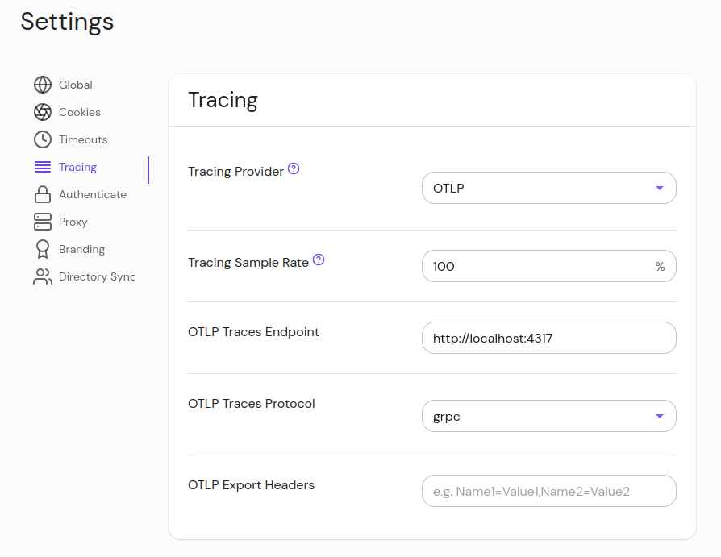
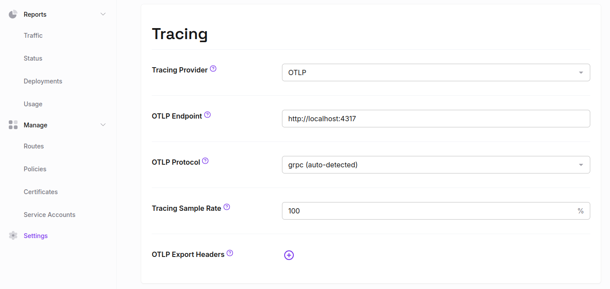
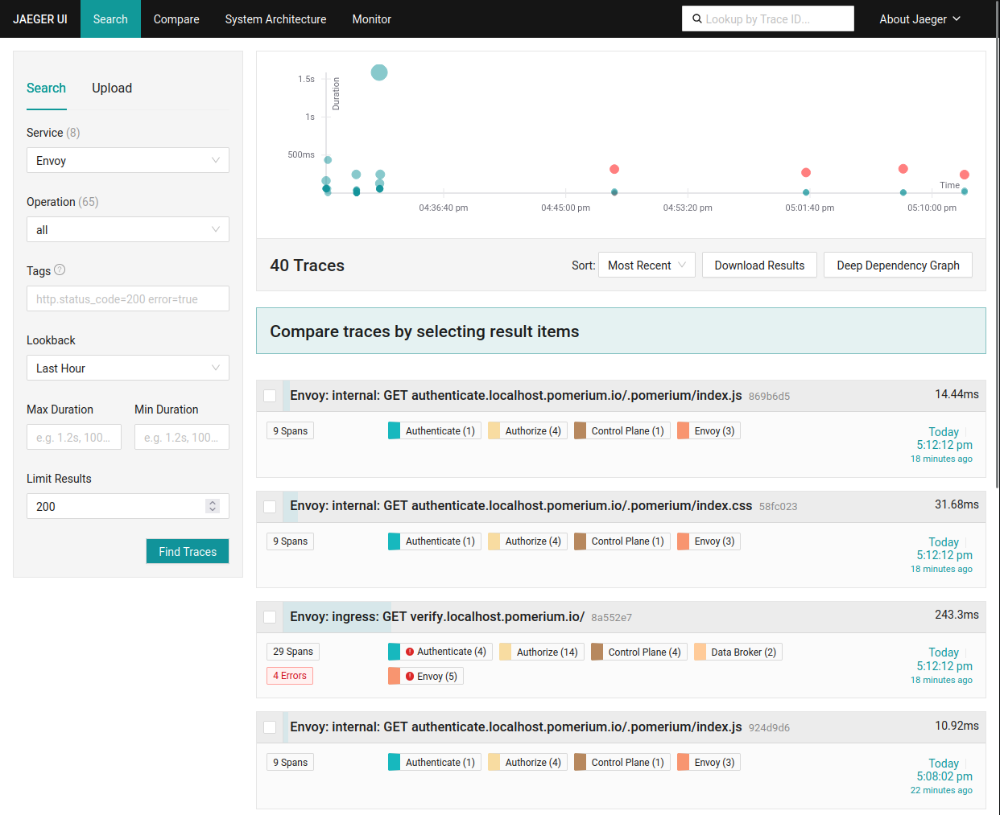
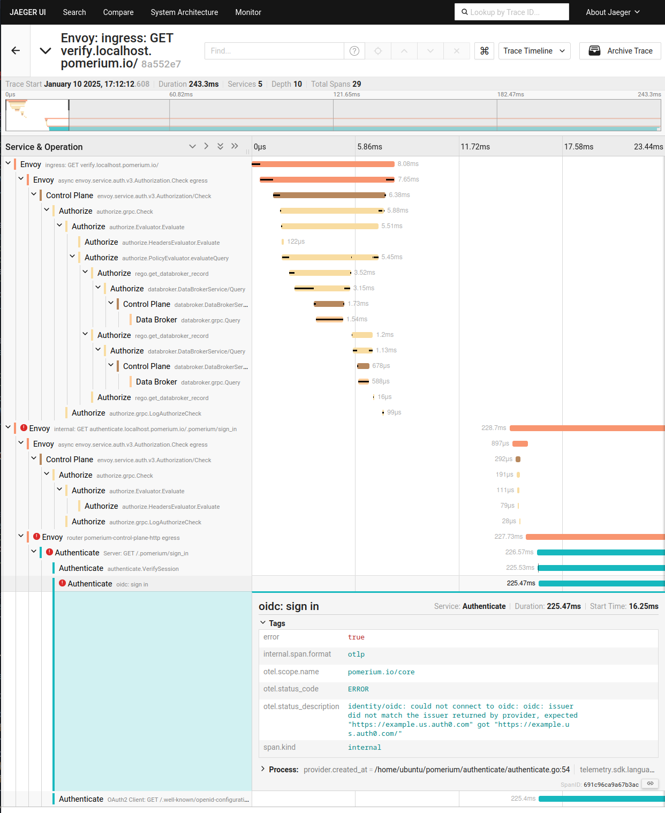
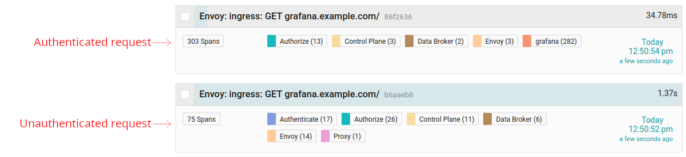
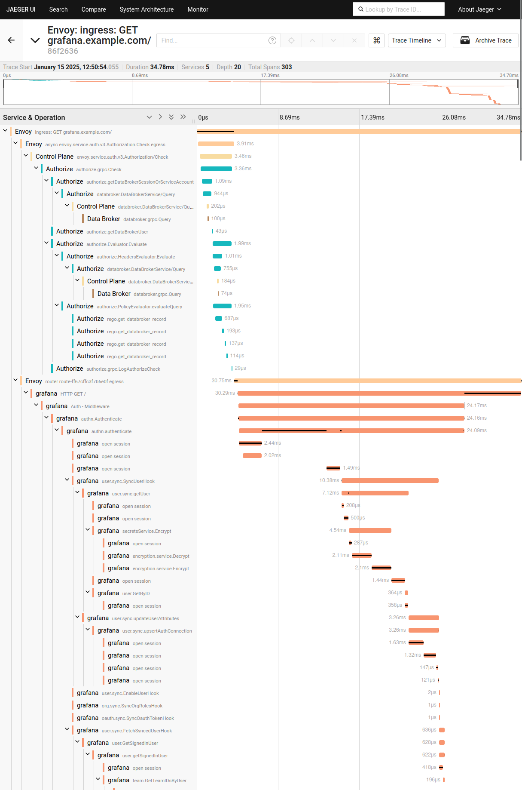
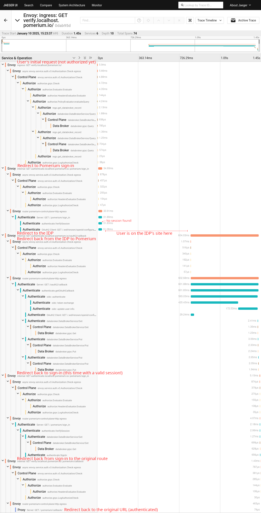
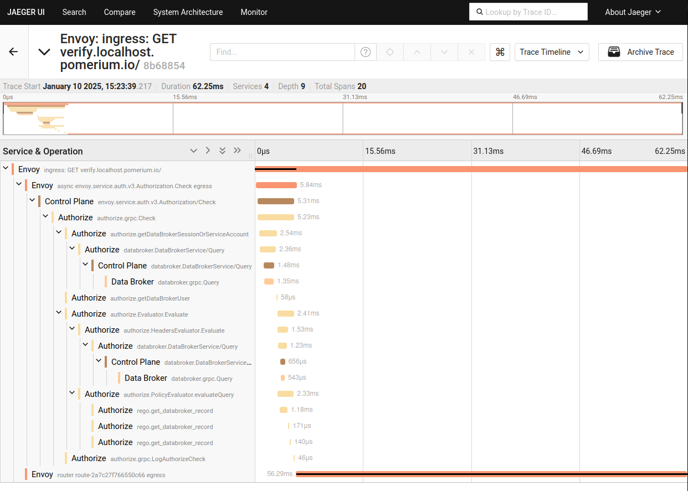

import Tabs from '@theme/Tabs';
import TabItem from '@theme/TabItem';

# Tracing

## Summary

Pomerium has comprehensive support for OpenTelemetry (OTel) tracing, allowing detailed introspection into requests and authorization flows. You can use tracing to debug errors and latency issues in your applications.

## Configuration

<Tabs>
<TabItem value="Core" label="Core">

### Environment Variables

The recommended way to configure tracing is by using the standard OpenTelemetry environment variables:

- [SDK environment variables][topic/general-sdk-cfg]
- [OTLP exporter environment variables][topic/exp-env]

The following environment variables are supported in Pomerium:

| Name | Description | Type | Default |
| :-- | :-- | :-- | :-- |
| [`OTEL_TRACES_EXPORTER`][env/otel_traces_exporter] | Trace exporter to be used. <br/> Valid values are `"otlp"` or `"none"`. | [Enum][topic/enum] | `"none"` |
| [`OTEL_EXPORTER_OTLP_ENDPOINT`][env/otel_exporter_otlp_endpoint] or <br/> [`OTEL_EXPORTER_OTLP_TRACES_ENDPOINT`][env/otel_exporter_otlp_traces_endpoint] | An OTLP/gRPC or OTLP/HTTP base endpoint URL with optional port.<br/>Example: `http://localhost:4318`<br/>See [OTLP Endpoint Configuration][topic/exp-endpoint-cfg] for more details. | [String][topic/string] |  |
| [`OTEL_EXPORTER_OTLP_PROTOCOL`][env/otel_exporter_otlp_protocol] or <br/> [`OTEL_EXPORTER_OTLP_TRACES_PROTOCOL`][env/otel_exporter_otlp_traces_protocol] | Valid values are `"grpc"` or `"http/protobuf"`. <br/>If unset, Pomerium will attempt to determine the protocol based on the endpoint port number (the standard ports are 4317 for GRPC, 4318 for HTTP), otherwise it will default to `"http/protobuf"` <br/>See [OTLP Exporter Configuration][topic/exp-protocol-cfg] for more details. | [String][topic/string] |  |
| [`OTEL_EXPORTER_OTLP_HEADERS`][env/otel_exporter_otlp_headers] or <br/> [`OTEL_EXPORTER_OTLP_TRACES_HEADERS`][env/otel_exporter_otlp_traces_headers] | Comma-separated `key=value` pairs containing HTTP headers to add when exporting trace data. <br/>Example: <code>Authentication=Bearer&nbsp;xxx,Foo=Bar</code><br/>See [OTLP Endpoint Configuration][topic/exp-header-cfg] for more details. | [String][topic/string] |  |
| [`OTEL_EXPORTER_OTLP_TIMEOUT`][env/otel_exporter_otlp_timeout] or <br/> [`OTEL_EXPORTER_OTLP_TRACES_TIMEOUT`][env/otel_exporter_otlp_traces_timeout] | Export request timeout duration in milliseconds.<br/> See [OTLP Endpoint Configuration][topic/exp-timeout-cfg] for more details. | [Duration][topic/duration] | `10000` (ms) |
| [`OTEL_TRACES_SAMPLER_ARG`][env/otel_traces_sampler_arg] | Sampling probability, a number in the \[0..1\] range.<br/> Examples: `1.0` (sample all traces), `0.25` (sample 25% of traces). | Float | `1.0` |
| [`OTEL_RESOURCE_ATTRIBUTES`][env/otel_resource_attributes] | Comma-separated `key=value` pairs of additional resource attributes. <br/> Example: `key1=value1,key2=value2` | [String][topic/string] |  |
| [`OTEL_BSP_SCHEDULE_DELAY`][env/otel_bsp_schedule_delay] | Interval in milliseconds at which pending spans (if any) are exported. Minimum 100 (ms). | [Duration][topic/duration] | `5000` (ms) |
| [`OTEL_BSP_MAX_EXPORT_BATCH_SIZE`][env/otel_bsp_max_export_batch_size] | Number of pending spans needed to automatically trigger an export. Note that spans are still exported on a fixed interval, even if this limit is not reached. Minimum 1. | [Integer][topic/integer] | `512` |
| [`OTEL_LOG_LEVEL`][env/otel_log_level] | OTel SDK internal log level. | [Enum][topic/enum] | `"info"` |
| [`OTEL_ATTRIBUTE_VALUE_LENGTH_LIMIT`][env/otel_attribute_value_length_limit] | Maximum allowed attribute value size. <br/> Increase this to prevent long URLs in span attributes from being truncated. | [Integer][topic/integer] | `256` |

### Config file

Tracing can also be configured using the Pomerium config file if desired. The field names in the config file are identical to the environment variable names, but in lowercase.

| Config Key | Equivalent Environment Variable | Type |
| :-- | :-- | :-- |
| `otel_traces_exporter` | [`OTEL_TRACES_EXPORTER`][env/otel_traces_exporter] | `string` |
| `otel_exporter_otlp_endpoint` | [`OTEL_EXPORTER_OTLP_ENDPOINT`][env/otel_exporter_otlp_endpoint] | `string` |
| `otel_exporter_otlp_traces_endpoint` | [`OTEL_EXPORTER_OTLP_TRACES_ENDPOINT`][env/otel_exporter_otlp_traces_endpoint] | `string` |
| `otel_exporter_otlp_protocol` | [`OTEL_EXPORTER_OTLP_PROTOCOL`][env/otel_exporter_otlp_protocol] | `string` |
| `otel_exporter_otlp_traces_protocol` | [`OTEL_EXPORTER_OTLP_TRACES_PROTOCOL`][env/otel_exporter_otlp_traces_protocol] | `string` |
| `otel_exporter_otlp_headers` | [`OTEL_EXPORTER_OTLP_HEADERS`][env/otel_exporter_otlp_headers] | `[]string` |
| `otel_exporter_otlp_traces_headers` | [`OTEL_EXPORTER_OTLP_TRACES_HEADERS`][env/otel_exporter_otlp_traces_headers] | `[]string` |
| `otel_exporter_otlp_timeout` | [`OTEL_EXPORTER_OTLP_TIMEOUT`][env/otel_exporter_otlp_timeout] | `int64` |
| `otel_exporter_otlp_traces_timeout` | [`OTEL_EXPORTER_OTLP_TRACES_TIMEOUT`][env/otel_exporter_otlp_traces_timeout] | `int64` |
| `otel_traces_sampler_arg` | [`OTEL_TRACES_SAMPLER_ARG`][env/otel_traces_sampler_arg] | `float64` |
| `otel_resource_attributes` | [`OTEL_RESOURCE_ATTRIBUTES`][env/otel_resource_attributes] | `[]string` |
| `otel_bsp_schedule_delay` | [`OTEL_BSP_SCHEDULE_DELAY`][env/otel_bsp_schedule_delay] | `int64` |
| `otel_bsp_max_export_batch_size` | [`OTEL_BSP_MAX_EXPORT_BATCH_SIZE`][env/otel_bsp_max_export_batch_size] | `int32` |
| `otel_log_level` | [`OTEL_LOG_LEVEL`][env/otel_log_level] | `string` |
| `otel_attribute_value_length_limit` | [`OTEL_ATTRIBUTE_VALUE_LENGTH_LIMIT`][env/otel_attribute_value_length_limit] | `int32` |

</TabItem>
<TabItem value="Ingress Controller" label="Ingress Controller">
OpenTelemetry tracing options can be configured in the `Pomerium` CRD, for example:

```yaml
apiVersion: ingress.pomerium.io/v1
kind: Pomerium
metadata:
  name: example
spec:
  ...
  otel:
    endpoint: http://jaeger-collector:4317
    protocol: grpc
    headers:
      key: value
    timeout: 10s
    sampling: 1.0
    resourceAttributes:
      key: value
    bspScheduleDelay: 5s
    bspMaxExportBatchSize: 512
    logLevel: info
```

See the [CRD Definition](https://github.com/pomerium/ingress-controller/blob/a3eea872d5ab8048afa94638223b6e5109cb0132/apis/ingress/v1/pomerium_types.go#L309) for additional details.

</TabItem>
<TabItem value="Enterprise" label="Enterprise">

1. In the Enterprise Console, navigate to Settings > Tracing

2. In the "Tracing Provider" dropdown, select "OTLP"

3. Enter your desired sample rate and OTLP endpoint

4. Optionally, enter a protocol ("grpc" or "http/protobuf"). If the endpoint uses port 4317 or 4318, the protocol will be selected automatically. Port 4317 is the standard for OTLP GRPC, and 4318 for OTLP HTTP.



</TabItem>
<TabItem value="Zero" label="Zero">

1. In the Zero dashboard, navigate to Settings > Tracing

2. In the "Tracing Provider" dropdown, select "OTLP"

3. Enter your desired sample rate and OTLP endpoint

4. Optionally, enter a protocol ("grpc" or "http/protobuf"). If the endpoint uses port 4317 or 4318, the protocol will be selected automatically. Port 4317 is the standard for OTLP GRPC, and 4318 for OTLP HTTP.



</TabItem>
</Tabs>

## Examples

### Using Jaeger to visualize trace data

[Jaeger](https://www.jaegertracing.io/) is a popular open-source tracing platform. It can be used to collect trace data and visualize it in the browser.

1. Run Jaeger in all-in-one mode with Docker:

```bash
$ docker run -d --name jaeger \
  -p 16686:16686 \
  -p 4317:4317 \
  -p 4318:4318 \
  jaegertracing/jaeger:latest
```

2. Run Pomerium with OpenTelemetry environment variables set:

```bash
$ OTEL_TRACES_EXPORTER=otlp OTEL_EXPORTER_OTLP_ENDPOINT=http://localhost:4317 pomerium --config path/to/your/config.yaml`
```

3. Navigate to a Pomerium route defined in the config file

4. Open your browser to http://localhost:16686 to view traces in the Jaeger UI.

### Tracing errors

A typo in the OAuth2 issuer URL configuration is a common mistake that can lead to unexpected errors. A user attempting to navigate to a Pomerium route that requires authentication might see an error page instead of being redirected to the Identity Provider. In the Jaeger UI, traces that contain errors are highlighted and easy to find:



Clicking on this trace will show us the original unauthenticated request (`GET https://verify.localhost.pomerium.io/`) and that it was redirected to sign in. When attempting to initiate the auth flow, an error was encountered, which was recorded in the trace:



Clicking on the span that recorded the error will show the error message - we are missing a trailing slash in the issuer URL!

### Tracing upstream applications

If upstream applications also have OpenTelemetry support, traces will propagate through Pomerium to those applications and the combined trace data will be visible.

#### Example: Grafana

[Grafana](https://grafana.com/) is a good example of an upstream application that has tracing support and is easily integrated with Pomerium.

The [Securing Grafana with Pomerium](../guides/grafana.mdx) guide can help you get started with a new Grafana deployment.

To enable OpenTelemetry traces in Grafana, set the environment variable `GF_TRACING_OPENTELEMETRY_OTLP_ADDRESS` to the same ip:port (without scheme) as the OTLP endpoint configured in Pomerium.

Alternatively, this can be set in the Grafana config file:

```ini
# grafana.ini
[tracing.opentelemetry.otlp]
address = x.x.x.x:4317
```

Note that at the time of writing, Grafana only supports exporting OTLP traces with the GRPC protocol. Most tracing backends, like Jaeger or the OTel Collector, support both protocols however.

With tracing enabled in both Pomerium and Grafana, navigate to your Grafana route. After a few seconds, the combined traces should be visible in Jaeger:



The bottom trace (occurred first) is the initial unauthenticated request to Pomerium. The top trace is the authenticated request, after the user signed in and was redirected. This trace includes spans exported by Grafana itself, which we can see in detail:



Grafana exports very detailed traces, which can be helpful in debugging complex issues. The combined trace data helps easily visualize the request flow between Pomerium and Grafana, or any other upstream application.

### Visualizing the Pomerium auth flow

Pomerium can trace a request's entire journey through the authentication process, across multiple individual redirects between Pomerium services and the Identity Provider.

For example, this trace shows an unauthenticated request (`GET https://verify.localhost.pomerium.io/`) that triggered a sequence of redirects to perform the auth flow:



The trace above ends with a final redirect to repeat the original request, but this time the user is authenticated:



This trace ends with the proxied request to the upstream server.

{/* prettier-ignore-start */}

[topic/duration]:                         https://opentelemetry.io/docs/specs/otel/configuration/sdk-environment-variables/#duration
[topic/integer]:                          https://opentelemetry.io/docs/specs/otel/configuration/sdk-environment-variables/#integer
[topic/string]:                           https://opentelemetry.io/docs/specs/otel/configuration/sdk-environment-variables/#string
[topic/enum]:                             https://opentelemetry.io/docs/specs/otel/configuration/sdk-environment-variables/#enum
[topic/exp-env]:                          https://opentelemetry.io/docs/specs/otel/configuration/sdk-environment-variables
[topic/general-sdk-cfg]:                  https://opentelemetry.io/docs/specs/otel/configuration/sdk-environment-variables/#general-sdk-configuration
[topic/exp-endpoint-cfg]:                 https://opentelemetry.io/docs/languages/sdk-configuration/otlp-exporter/#endpoint-configuration
[topic/exp-header-cfg]:                   https://opentelemetry.io/docs/languages/sdk-configuration/otlp-exporter/#header-configuration
[topic/exp-protocol-cfg]:                 https://opentelemetry.io/docs/languages/sdk-configuration/otlp-exporter/#protocol-configuration
[topic/exp-timeout-cfg]:                  https://opentelemetry.io/docs/languages/sdk-configuration/otlp-exporter/#timeout-configuration

[env/otel_attribute_value_length_limit]:  https://opentelemetry.io/docs/specs/otel/configuration/sdk-environment-variables/#:~:text=OTEL_ATTRIBUTE_VALUE_LENGTH_LIMIT
[env/otel_bsp_max_export_batch_size]:     https://opentelemetry.io/docs/specs/otel/configuration/sdk-environment-variables/#:~:text=OTEL_BSP_MAX_EXPORT_BATCH_SIZE
[env/otel_bsp_schedule_delay]:            https://opentelemetry.io/docs/specs/otel/configuration/sdk-environment-variables/#:~:text=OTEL_BSP_SCHEDULE_DELAY
[env/otel_log_level]:                     https://opentelemetry.io/docs/specs/otel/configuration/sdk-environment-variables/#:~:text=OTEL_LOG_LEVEL
[env/otel_traces_exporter]:               https://opentelemetry.io/docs/specs/otel/configuration/sdk-environment-variables/#:~:text=OTEL_TRACES_EXPORTER
[env/otel_exporter_otlp_endpoint]:        https://opentelemetry.io/docs/languages/sdk-configuration/otlp-exporter/#otel_exporter_otlp_endpoint
[env/otel_exporter_otlp_headers]:         https://opentelemetry.io/docs/languages/sdk-configuration/otlp-exporter/#otel_exporter_otlp_headers
[env/otel_exporter_otlp_protocol]:        https://opentelemetry.io/docs/languages/sdk-configuration/otlp-exporter/#otel_exporter_otlp_protocol
[env/otel_exporter_otlp_timeout]:         https://opentelemetry.io/docs/languages/sdk-configuration/otlp-exporter/#otel_exporter_otlp_timeout
[env/otel_exporter_otlp_traces_endpoint]: https://opentelemetry.io/docs/languages/sdk-configuration/otlp-exporter/#otel_exporter_otlp_traces_endpoint
[env/otel_exporter_otlp_traces_headers]:  https://opentelemetry.io/docs/languages/sdk-configuration/otlp-exporter/#otel_exporter_otlp_traces_headers
[env/otel_exporter_otlp_traces_protocol]: https://opentelemetry.io/docs/languages/sdk-configuration/otlp-exporter/#otel_exporter_otlp_traces_protocol
[env/otel_exporter_otlp_traces_timeout]:  https://opentelemetry.io/docs/languages/sdk-configuration/otlp-exporter/#otel_exporter_otlp_traces_timeout
[env/otel_resource_attributes]:           https://opentelemetry.io/docs/languages/sdk-configuration/general/#otel_resource_attributes
[env/otel_traces_sampler_arg]:            https://opentelemetry.io/docs/languages/sdk-configuration/general/#otel_traces_sampler_arg

{/* prettier-ignore-end */}
