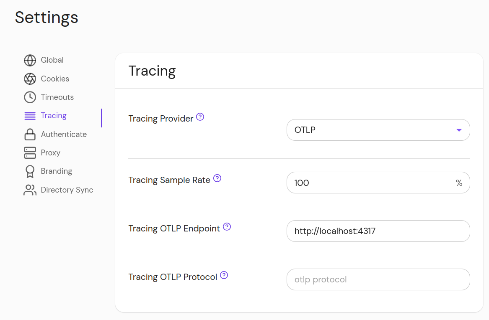
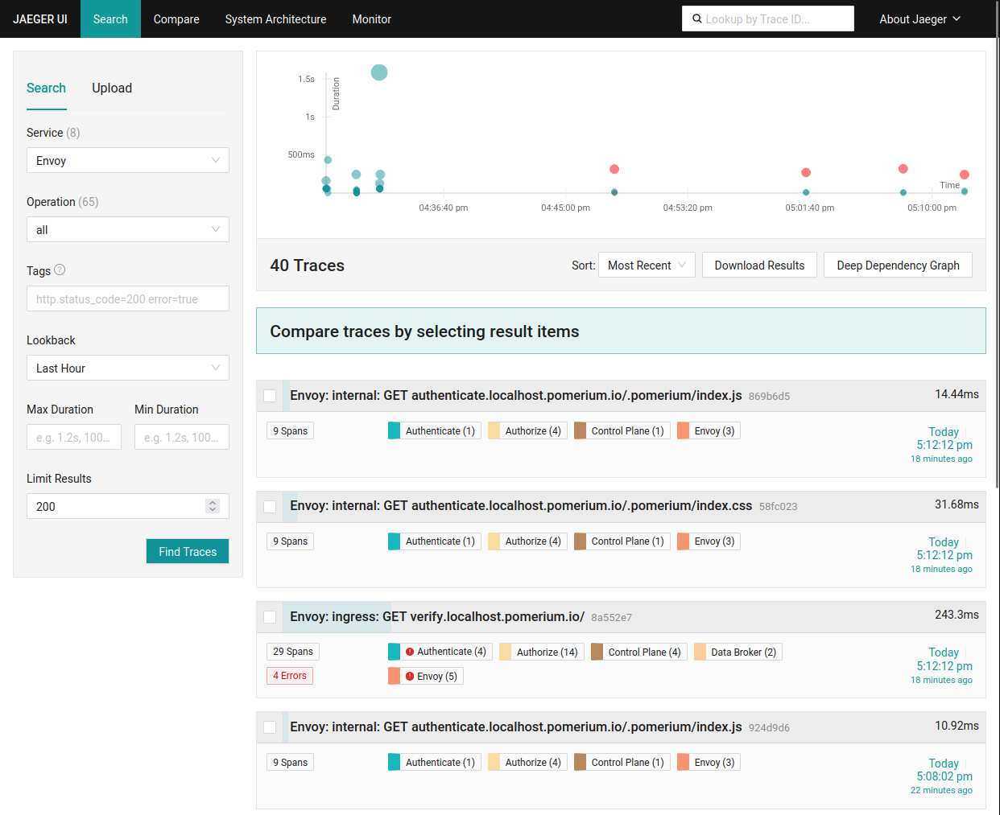
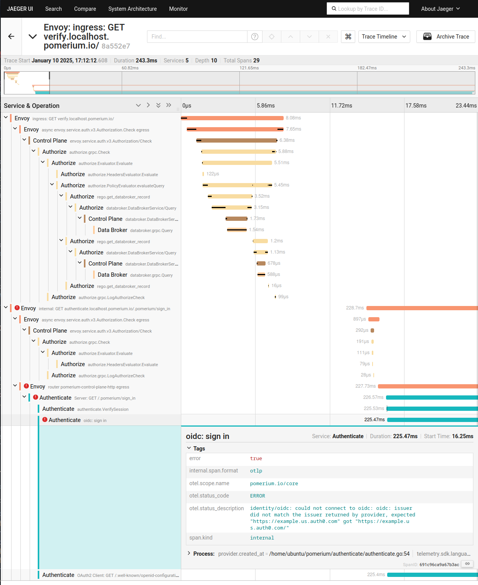
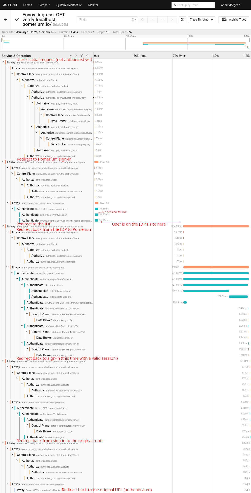
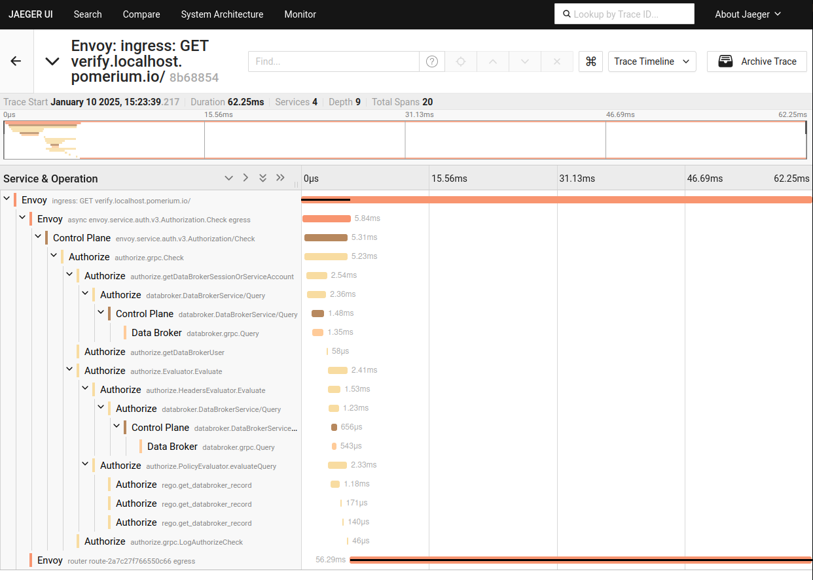

import Tabs from '@theme/Tabs';
import TabItem from '@theme/TabItem';

# Tracing

## Summary

Pomerium has comprehensive support for OpenTelemetry tracing, allowing detailed introspection into requests and authorization flows.
You can use tracing to debug errors and latency issues in your applications.

## Configuration

<Tabs>
<TabItem value="Core" label="Core">

### Environment Variables

The recommended way to configure tracing is by using the standard OpenTelemetry environment variables:
- [SDK environment variables](https://opentelemetry.io/docs/specs/otel/configuration/sdk-environment-variables/#general-sdk-configuration)
- [OTLP exporter environment variables](https://opentelemetry.io/docs/languages/sdk-configuration/otlp-exporter/)

The main variables used to configure tracing in Pomerium are the following:

| Name | Description | Default |
| :--- | :---------- | :------ |
| [`OTEL_TRACES_EXPORTER`](https://opentelemetry.io/docs/specs/otel/configuration/sdk-environment-variables/#exporter-selection) | Trace exporter to be used. <br/> Valid values are `"otlp"` or `"none"` | `"none"` |
| [`OTEL_EXPORTER_OTLP_ENDPOINT`](https://opentelemetry.io/docs/languages/sdk-configuration/otlp-exporter/#otel_exporter_otlp_endpoint) or <br/> [`OTEL_EXPORTER_OTLP_TRACES_ENDPOINT`](https://opentelemetry.io/docs/languages/sdk-configuration/otlp-exporter/#otel_exporter_otlp_traces_endpoint) | See [Endpoint Configuration](https://opentelemetry.io/docs/languages/sdk-configuration/otlp-exporter/#endpoint-configuration). |
| [`OTEL_EXPORTER_OTLP_PROTOCOL`](https://opentelemetry.io/docs/languages/sdk-configuration/otlp-exporter/#otel_exporter_otlp_protocol) or <br/> [`OTEL_EXPORTER_OTLP_TRACES_PROTOCOL`](https://opentelemetry.io/docs/languages/sdk-configuration/otlp-exporter/#otel_exporter_otlp_traces_protocol) | See [Protocol Configuration](https://opentelemetry.io/docs/languages/sdk-configuration/otlp-exporter/#protocol-configuration). <br/> Valid values are `"grpc"` or `"http/protobuf"`. <br/>If unset, Pomerium will attempt to determine the protocol based on the endpoint port number (the standard ports are 4317 for GRPC, 4318 for HTTP), otherwise it will default to `"http/protobuf"`. | (auto) |
| [`OTEL_TRACES_SAMPLER_ARG`](https://opentelemetry.io/docs/languages/sdk-configuration/general/#otel_traces_sampler_arg) | Sampling probability, a number in the \[0..1\] range, e.g. `1.0` (sample all traces) or `0.25` (sample 25% of traces) | `1.0` |

### Config file

Tracing can also be configured using the Pomerium config file if desired:

| Config Key | Equivalent Environment Variable |
| :--- | :---------- |
| `tracing_provider` | [`OTEL_TRACES_EXPORTER`](https://opentelemetry.io/docs/specs/otel/configuration/sdk-environment-variables/#exporter-selection) |
| `tracing_otlp_endpoint` | [`OTEL_EXPORTER_OTLP_TRACES_ENDPOINT`](https://opentelemetry.io/docs/languages/sdk-configuration/otlp-exporter/#otel_exporter_otlp_traces_endpoint) |
| `tracing_otlp_protocol` | [`OTEL_EXPORTER_OTLP_TRACES_PROTOCOL`](https://opentelemetry.io/docs/languages/sdk-configuration/otlp-exporter/#otel_exporter_otlp_traces_protocol) |
| `tracing_sample_rate` | [`OTEL_TRACES_SAMPLER_ARG`](https://opentelemetry.io/docs/languages/sdk-configuration/general/#otel_traces_sampler_arg) |

</TabItem>
<TabItem value="Enterprise" label="Enterprise">

1. In the Enterprise Console, navigate to Settings > Tracing

2. In the "Tracing Provider" dropdown, select "OTLP"

3. Enter your desired sample rate and OTLP endpoint

4. Optionally, enter a protocol ("grpc" or "http/protobuf"). If the endpoint uses port 4317 or 4318, the protocol will be selected automatically. Port 4317 is the standard for OTLP GRPC, and 4318 for OTLP HTTP.


</TabItem>
</Tabs>

## Examples

### Using Jaeger to visualize trace data

[Jaeger](https://www.jaegertracing.io/) is a popular open-source tracing platform. It can be used to collect trace data and visualize it in the browser.

1. Run Jaeger in all-in-one mode with Docker:

```bash
$ docker run -d --name jaeger \
  -p 16686:16686 \
  -p 4317:4317 \
  -p 4318:4318 \
  jaegertracing/jaeger:latest
```

2. Run Pomerium with OpenTelemetry environment variables set:
```bash
$ OTEL_TRACES_EXPORTER=otlp OTEL_EXPORTER_OTLP_ENDPOINT=http://localhost:4317 pomerium --config path/to/your/config.yaml`
```

3. Navigate to a Pomerium route defined in the config file

4. Open your browser to http://localhost:16686 to view traces in the Jaeger UI.

### Tracing errors

A typo in the OAuth2 issuer URL configuration is a common mistake that can lead to unexpected errors.
A user attempting to navigate to a Pomerium route that requires authentication might see an error page instead of being redirected to the Identity Provider.
In the Jaeger UI, traces that contain errors are highlighted and easy to find:



Clicking on this trace will show us the original unauthenticated request (`GET https://verify.localhost.pomerium.io/`) and that it was redirected to sign in.
When attempting to initiate the auth flow, an error was encountered, which was recorded in the trace:



Clicking on the span that recorded the error will show the error message - we are missing a trailing slash in the issuer URL!

### Visualizing the Pomerium auth flow

Pomerium can trace a request's entire journey through the authentication process, across multiple individual redirects between Pomerium services and the Identity Provider.

For example, this trace shows an unauthenticated request (`GET https://verify.localhost.pomerium.io/`) that triggered a sequence of redirects to perform the auth flow:



The trace above ends with a final redirect to repeat the original request, but this time the user is authenticated:



This trace ends with the proxied request to the upstream server.

