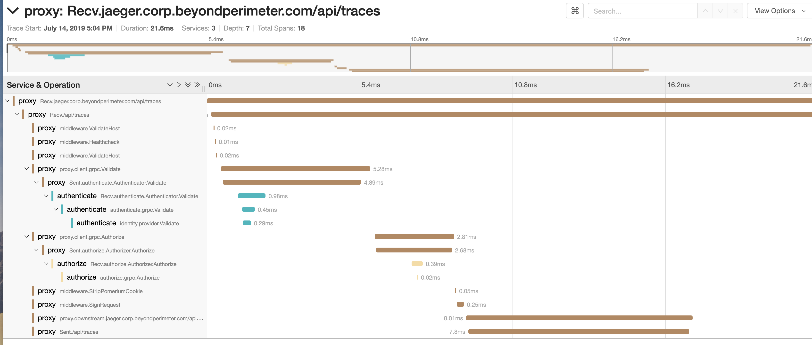

import Tabs from '@theme/Tabs';
import TabItem from '@theme/TabItem';

# Tracing

## Summary

Tracing tracks the progression of a single user request as it is handled by Pomerium.

Each unit of work is called a Span in a trace. Spans include metadata about the work, including the time spent in the step (latency), status, time events, attributes, links. You can use tracing to debug errors and latency issues in your applications, including in downstream connections.

## How to configure

<Tabs>
<TabItem value="Core" label="Core">

#### Shared Tracing Settings

| Config Key | Description | Required |
| :-- | :-- | --- |
| tracing_provider | The name of the tracing provider. (e.g. Jaeger, Zipkin) | ✅ |
| tracing_sample_rate | Percentage of requests to sample in decimal notation. Default is `0.0001`, or .01% | ❌ |

Set `tracing_sample_rate = 1` if you want to see all requests in the tracings.

#### Datadog

Datadog is a real-time monitoring system that supports distributed tracing and monitoring.

| Config Key | Description | Required |
| :-- | :-- | --- |
| tracing_datadog_address | `host:port` address of the Datadog Trace Agent. Defaults to `localhost:8126` | ❌ |

#### Jaeger (partial)

**Warning** At this time, the Jaeger protocol does not capture spans inside the Proxy Service. Please use the Zipkin protocol with Jaeger for full support.

[Jaeger](https://www.jaegertracing.io/) is a distributed tracing system released as open source by Uber Technologies. It is used for monitoring and troubleshooting microservices-based distributed systems, including:

- Distributed context propagation
- Distributed transaction monitoring
- Root cause analysis
- Service dependency analysis
- Performance / latency optimization

| Config Key | Description | Required |
| :-- | :-- | --- |
| tracing_jaeger_collector_endpoint | Url to the Jaeger HTTP Thrift collector. | ✅ |
| tracing_jaeger_agent_endpoint | Send spans to jaeger-agent at this address. | ✅ |

For quick local testing, use Jaeger all-in-one, which is an executable designed to launch the Jaeger UI, jaeger-collector, jaeger-query, and jaeger-agent, with an in-memory storage component.

```bash
docker run -d --name jaeger \
  -e COLLECTOR_ZIPKIN_HOST_PORT=:9411 \
  -e COLLECTOR_OTLP_ENABLED=true \
  -p 6831:6831/udp \
  -p 6832:6832/udp \
  -p 5778:5778 \
  -p 16686:16686 \
  -p 4317:4317 \
  -p 4318:4318 \
  -p 14250:14250 \
  -p 14268:14268 \
  -p 14269:14269 \
  -p 9411:9411 \
  jaegertracing/all-in-one:1.45

```

Pomerium settings

```yaml
tracing_provider: jaeger
tracing_jaeger_collector_endpoint: http://localhost:14268/api/traces
tracing_jaeger_agent_endpoint: http://localhost:6831
```

Open Jaeger UI at `http://localhost:16686` in the browser to view Pomerium traces.

#### Zipkin

Zipkin is an open-source distributed tracing system and protocol.

Many tracing backends support Zipkin either directly or through intermediary agents, including Jaeger. For full tracing support, we recommend using the Zipkin tracing protocol.

| Config Key              | Description                      | Required |
| :---------------------- | :------------------------------- | -------- |
| tracing_zipkin_endpoint | Url to the Zipkin HTTP endpoint. | ✅       |

</TabItem>
<TabItem value="Enterprise" label="Enterprise">

Configure **Tracing** in the Console:

1. Select a **Tracing Provider** and set **Sample Tracing Rate**


2. Configure tracing **Endpoints**


</TabItem>
</Tabs>

### Examples


