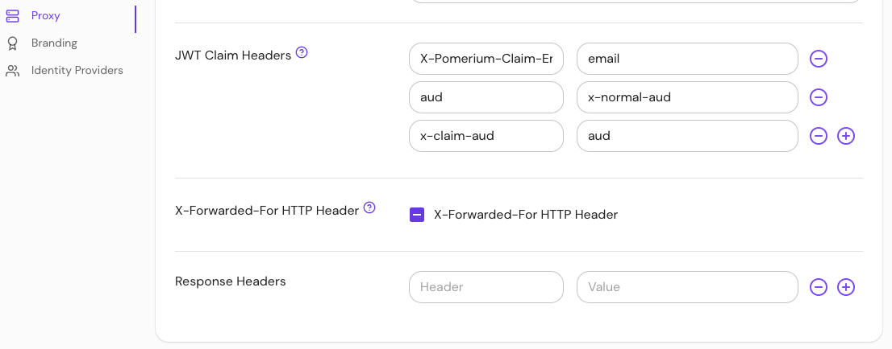

import Tabs from '@theme/Tabs';
import TabItem from '@theme/TabItem';

# X-Forwarded-For HTTP Header

## Summary

**X-Forwarded-For HTTP Header** indicates the IP addresses that a request has flowed through on its way from the client to the server.

Do not append proxy IP addresses to the `x-forwarded-for` HTTP header. See the [Envoy](https://www.envoyproxy.io/docs/envoy/latest/configuration/http/http_conn_man/headers.html?highlight=skip_xff_append#x-forwarded-for) docs for more information.

## How to configure

| **Type** | **Default** |
| :--- | :--- |
| `boolean` | `false` |

<Tabs>
<TabItem value="Core" label="Core">

| **Config file keys** | **Environment variables** |
| :--- | :--- |
| `skip_xff_append` | `SKIP_XFF_APPEND` |

</TabItem>
<TabItem value="Enterprise" label="Enterprise">

Configure **X-Forward-For HTTP Headers** with the toggle button in the Console. The button has three states:
- **Unset** ("-") uses the value in your configuration file
- **Checkmark** sets `skip_xff_append` to `true`
- **Empty** sets `skip_xff_append` to `false`



</TabItem>
<TabItem value="Kubernetes" label="Kubernetes">

Kubernetes does not support `skip_xff_append`

</TabItem>
</Tabs>

### Examples

```yaml
# config file key
skip_xff_append: true

# environment variable
SKIP_XFF_APPEND=true
```
