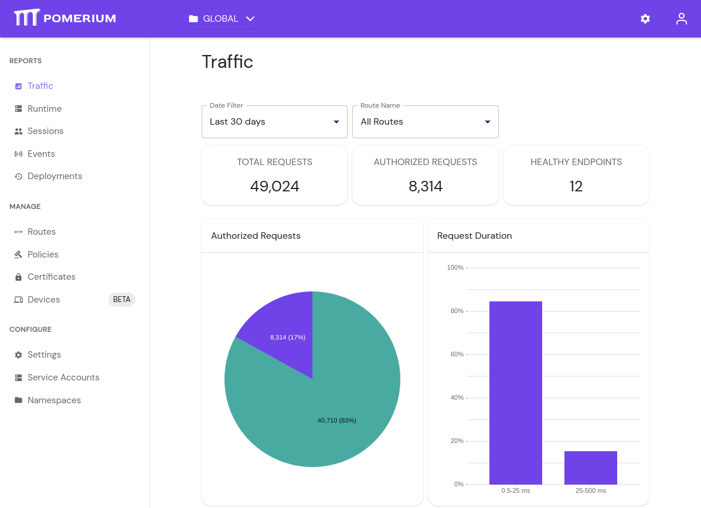

import PomeriumConsoleCertificate from '../../../../examples/kubernetes/pomerium-certificates.yaml.md';
import InstallMkcert from '@site/content/_generate-recovery-token.md';

# Install Pomerium Enterprise in Helm

This document covers installing Pomerium Enterprise into your existing helm-managed Kubernetes cluster. It's designed to work with an existing cluster running Pomerium, as described in [Pomerium using Helm]. Follow that document before continuing here.

:::caution

Helm installation is deprecated and is not recommended for new deployments. Please use [manifests-based installation](./kustomize) that provides a simpler installation experience.

:::

## Before You Begin

Pomerium Enterprise requires:

- An accessible RDBMS. We support PostgreSQL 9+.
  - A database and user with full permissions for it.
- A certificate management solution. This page will assume a store of certificates using [cert-manager] as the solution. If you use another certificate solution, adjust the steps accordingly.
- An existing Pomerium installation. If you don't already have open-source Pomerium installed in your cluster, see [Pomerium using Helm] before you continue.

## System Requirements

One of the advantages of a Kubernetes deployment is automatic scaling, but if your database solution is outside of your k8s configuration, refer to the requirements below:

- Each Postgres instance should have at least:
  - 4 vCPUs
  - 8G RAM
  - 20G for data files

## Issue a Certificate

This setup assumes an existing certificate solution using cert-manager, as described in [Pomerium using Helm]. If you already have a different certificate solution, create and implement a certificate for `pomerium-console.pomerium.svc.cluster.local`. Then you can move on to [the next stage](#update-pomerium).

1. Create a certificate configuration file for Pomerium Enterprise Our example is named `pomerium-console-certificate.yaml`:

   <PomeriumConsoleCertificate />

1. Apply the required certificate configurations, and confirm:

   ```bash
   kubectl apply -f pomerium-console-certificate.yaml
   ```

   ```bash
   kubectl get certificate
   NAME                    READY   SECRET                 AGE
   pomerium-cert           True    pomerium-tls           92m
   pomerium-console-cert   True    pomerium-console-tls   6s
   ```

## Update Pomerium

1. Set your local context to your Pomerium namespace:

   ```bash
   kubectl config set-context --current --namespace=pomerium
   ```

1. Open your pomerium values file. If you followed [Pomerium Using Helm], the file is named `pomerium-values.yaml`. In the `config` section, set a list item in the `routes` block for the Enterprise Console:

   ```yaml
   routes:
     - from: https://console.localhost.pomerium.com
       to: https://pomerium-console.pomerium.svc.cluster.local
       policy:
         - allow:
             or:
               - domain:
                   is: companydomain.com
       pass_identity_headers: true
   ```

1. If you haven't already, set `generateSigningKey` as false, and set a static `signingKey` value to be shared with the Enterprise Console. See [Reference: Signing Key](/docs/reference/signing-key) for information on generating a key:

   ```yaml
   config:
    ...
    generateSigningKey: false
    signingKey: "LR0tMS1BRUdHTiBFQ...."
    ...
   ```

   If `signingKey` wasn't already set, delete the generated `pomerium-signing-key` secret and restart the `pomerium-authorize` deployment:

   ```bash
   kubectl delete secret pomerium-signing-key
   kubectl rollout restart deployment pomerium-authorize
   ```

1. Use Helm to update your Pomerium installation:

   ```bash
   helm upgrade --install pomerium pomerium/pomerium --values=./pomerium-values.yaml
   ```

## Install Pomerium Enterprise

1. Create `pomerium-console-values.yaml` as shown below, replacing placeholder values:

   ```yaml title="pomerium-console-values.yaml"
   database:
     type: pg
     username: pomeriumDbUser
     password: IAMASTRONGPASSWORDLOOKATME
     host: 198.51.100.53
     name: pomeriumDbName
     sslmode: require
   config:
     sharedSecret: #Shared with Pomerium
     databaseEncryptionKey: #Generate from "head -c32 /dev/urandom | base64"
     administrators: 'youruser@yourcompany.com' #This is a hard-coded access, remove once setup is complete
     signingKey: 'ZZZZZZZ' #This base64-encoded key is shared with open-source Pomerium
     audience: console.localhost.pomerium.com # This should match the "from" value in your Pomerium route, excluding protocol.
     licenseKey: 'XXXYYYYZZZZ' # This should be provided by your account team.
   tls:
     existingCASecret: pomerium-tls
     caSecretKey: ca.crt
     existingSecret: pomerium-console-tls
     generate: false
   image:
     pullUsername: pomerium/enterprise
     pullPassword: your-access-key
   serviceMonitor:
     enabled: true
   metrics:
     enabled: true
   ```

```

```

1. The Pomerium repository should already be in your Helm configuration per [Pomerium using Helm]. If not, add it now:

   ```bash
   helm repo add pomerium https://helm.pomerium.io
   helm repo update
   ```

1. Install Pomerium Enterprise:

   ```bash
   helm install pomerium-console pomerium/pomerium-console --values=pomerium-console-values.yaml
   ```

1. If you haven't configured a public DNS record for your Pomerium domain space, you can use `kubectl` to generate a local proxy:

   ```bash
   sudo -E kubectl --namespace pomerium port-forward service/pomerium-proxy 443:443
   ```

1. When visiting `https://console.localhost.pomerium.io`, you should see the Traffic:

   

## Troubleshooting

### Updating Service Types:

If, while updating the open-source Pomerium values, you change any block's `service.type` you may need to manually delete corresponding service before applying the new configuration. For example:

```bash
kubectl delete svc pomerium-proxy
```

[pomerium using helm]: /docs/guides/helm
[cert-manager]: https://cert-manager.io/docs/

### Generate Recovery Token

<InstallMkcert />
