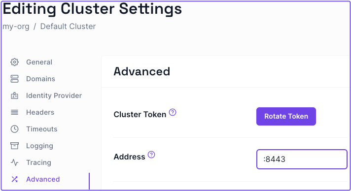
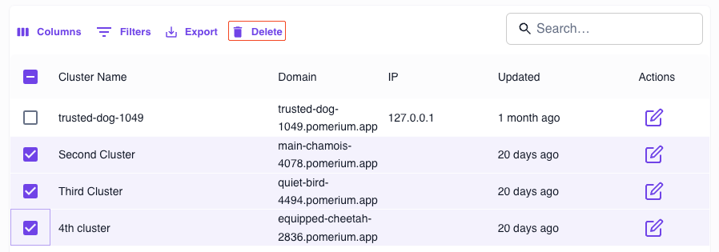

import Tabs from '@theme/Tabs';
import TabItem from '@theme/TabItem';

This document shows you how to troubleshoot various issues in Pomerium Zero.

## Configure port 443 to allow inbound access

**Problem**

Whenever you deploy a cluster, the Pomerium Zero cloud sends an inbound request to the cluster on port 443 to establish a secure connection. This is the default behavior. If the port is unavailable (for example, another process is already listening on port 443, or you haven't allowed a non-root process to bind to port 443), Pomerium Zero won't be able to establish a connection to your cluster.

**Solution**

Open the port so that it grants Pomerium inbound access on port 443. (For example, you can do this in Linux systems with the `CAP_NET_BIND_SERVICE` capability.)

If you've reserved port 443 for something else, you can change the port Pomerium sends inbound requests to by specifing a different listening port (like `:8443`) in the [**Address**](/docs/reference/address) field of the Zero Console:

1. Select **Settings**
1. Select **Advanced**
1. Enter the preferred port address
1. Apply your changes



:::info

Pomerium Zero also makes several outbound connections to the following `pomerium.app` domains on port `443` to fetch a cluster's configuration and status:

- console.pomerium.app:443
- connect.pomerium.app:443
- telemetry.pomerium.app:443

:::

## Delete a cluster

At some point, you may want to delete a cluster. Currently, you can only delete a cluster if you have multiple clusters.

To delete a cluster:

1. Select the clusters dropdown in the Zero Console navigation bar
1. Select **Manage Clusters**
1. Select the checkbox next to the cluster you want to delete, then select the **Delete** button in the table
1. In the popup, select **Delete** to confirm 

## Pomerium Zero loses configuration after upgrading

If you installed Pomerium using the Linux install script during the Pomerium Zero beta, you will need to re-run the install script the first time you upgrade Pomerium. (Subsequent upgrades will not require this step.)

1. First, find your current cluster token: look for a line beginning with `Environment=POMERIUM_ZERO_TOKEN=` in the file `/usr/lib/systemd/system/pomerium.service`.
1. Copy this token into the following command and run it:

```bash
$ curl https://console.pomerium.app/install.bash | \
  env POMERIUM_ZERO_TOKEN=<cluster_token> bash -s install
```
