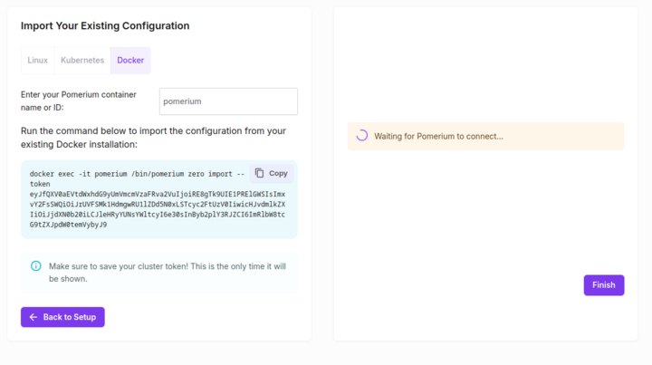
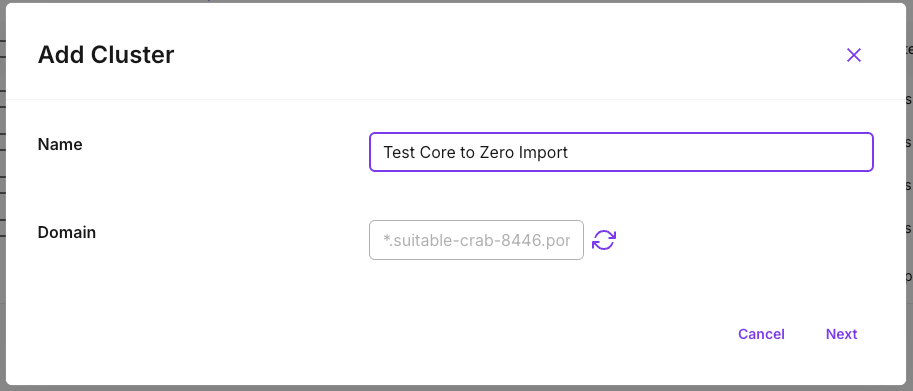
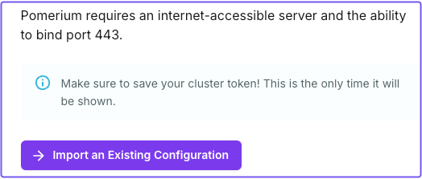
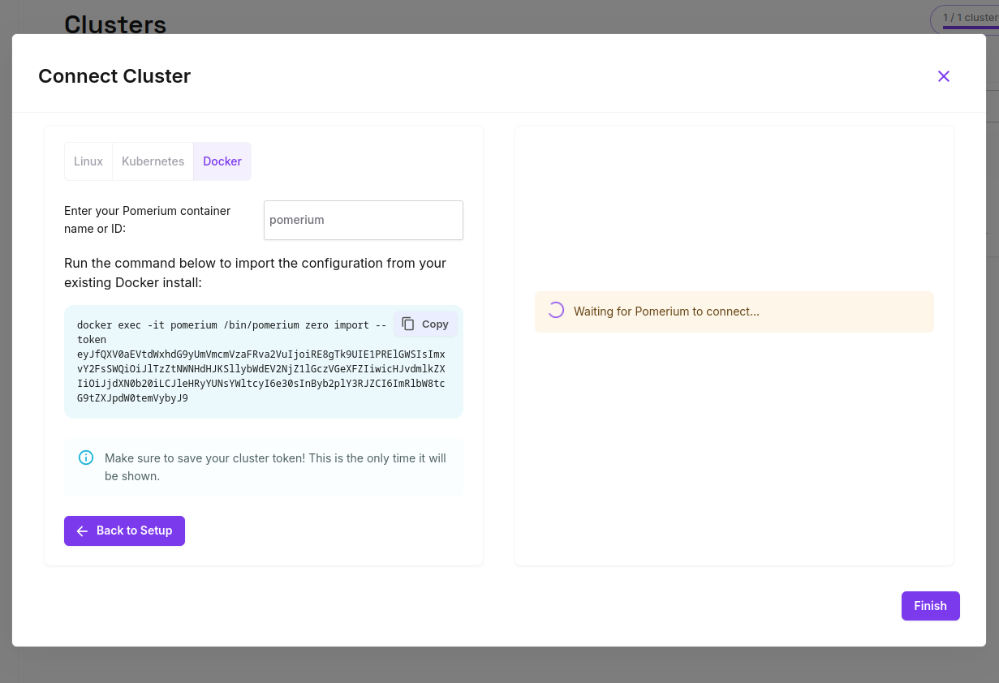
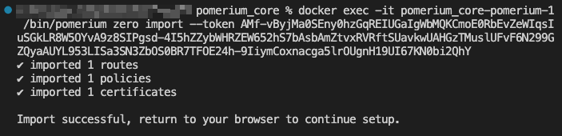
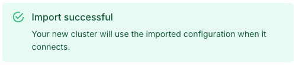

---
# cSpell:ignore freebind
id: import
title: Import Core config to Pomerium Zero
sidebar_label: Core to Zero Import
description: Learn how to import an existing Pomerium Core configuration into a Pomerium Zero cluster.
---

import Tabs from '@theme/Tabs'; import TabItem from '@theme/TabItem';

Learn how to import your existing open-source Pomerium Core configuration to Pomerium Zero.

## Overview

The **Core to Zero** import feature enables you to import an existing Pomerium Core configuration into a Pomerium Zero cluster with a simple CLI command. A successful import:

- Converts entities in Core to Pomerium Zero
- Removes duplicate policies from the configuration
- Prevents partial imports with quota checks

## Who is this for?

The Core to Zero import feature enables you to migrate an existing Pomerium Core configuration into a Pomerium Zero cluster. Without the import capability, you’d have to manually configure each route, policy, certificate, and config setting in Pomerium Zero.

This feature automates the process of importing your existing configuration so you don’t have to.

## Core to Zero import definitions

- **Entity:** any route, policy, certificate, or self-hosted domain defined in a Pomerium configuration.
- **Replica:** a separate Pomerium configuration that shares a storage backend with other replicas running in the same deployment.
- **Quota:** the amount of entities and replicas you can define in a cluster for free.

## How to import your Core configuration

This guide shows you how to import an existing Core configuration to Pomerium Zero.

### Before you start

To complete this guide, you need a:

- [Pomerium Zero](https://console.pomerium.app/create-account) account
- [Pomerium Core](/docs/core/quickstart) configuration

:::note

The Core to Zero import feature supports Core configurations running in Linux, Kubernetes, Docker, or a manual setup. This guide assumes Docker as the deployment environment.

:::

<Tabs>
<TabItem label="Zero Onboarding" value="zero-onboarding">

If you just signed up for Pomerium Zero, you can import an existing configuration when you onboard.

In the Zero onboarding screen:

1. Select **Docker**.
1. Select the **Import an Existing Configuration** button.
1. Enter the Docker container name or ID with the configuration you want to import.

   If the Docker name or ID is incorrect, run `docker ps` to see details about your containers. Find the name of the `pomerium/pomerium` container and enter it as the Pomerium container name.

1. Copy the generated Docker command.

   

</TabItem>
<TabItem label="New Cluster" value="new-cluster">

If you already have a Pomerium Zero account, you must create a new cluster to import your existing configuration.

In the Zero UI:

1. Select your cluster name in the navigation bar.
2. From the dropdown, select **Manage Clusters**.
3. Select **Add Cluster** and name it.

   

In the **Connect Cluster** screen:

1. Select **Docker.**
2. Select the **Import an Existing Configuration** button.

   

3. Enter the Docker container name or ID with the existing configuration you want to import.

   If the Docker name or ID is incorrect, run `docker ps` to see details about your containers. Find the name of the `pomerium/pomerium` container and enter it as the Pomerium container name.

4. Copy the generated Docker command.

   

</TabItem>
</Tabs>

### Run the import CLI command

Open your Docker project. In the integrated terminal:

1. Run your Docker containers:

   ```bash
   docker compose up
   ```

1. In a separate terminal window, paste the generated Docker command and run it. The CLI will notify you if the import was successful or not.

   

   You’ll also see a notification in the Zero UI:

   

1. Select **Finish**.

Check your cluster for the imported configuration.

## Additional resources

### Supported settings

Some settings available in Pomerium Core are not supported in Pomerium Zero. If unsupported settings are detected during an import, Pomerium will either remove them to complete the import or abort the import process.

The table below lists unsupported settings, and which settings cause an import failure:

| Unsupported config settings         | Fails import? |
| ----------------------------------- | ------------- |
| `authenticate_internal_service_url` | Yes           |
| `authorize_internal_service_url`    | Yes           |
| `databroker_internal_service_url`   | Yes           |
| `derive_tls`                        | Yes           |
| `audit_key`                         | No            |
| `primary_color`                     | No            |
| `secondary_color`                   | No            |
| `darkmode_primary_color`            | No            |
| `darkmode_secondary_color`          | No            |
| `logo_url`                          | No            |
| `favicon_url`                       | No            |
| `error_message_first_paragraph`     | No            |
| `use_proxy_protocol`                | No            |
| `envoy_bind_config_freebind`        | No            |
| `envoy_bind_config_source_address`  | No            |
| `metrics_certificate`               | No            |
| `metrics_client_ca`                 | No            |

### Quotas

When importing your Core configuration, the number of existing entities or replicas may exceed the personal account quotas in Pomerium Zero.

To accommodate Core configurations with lots of entities or multiple replicas, we temporarily increase quotas during the import process. This exception prevents partial configuration imports.
