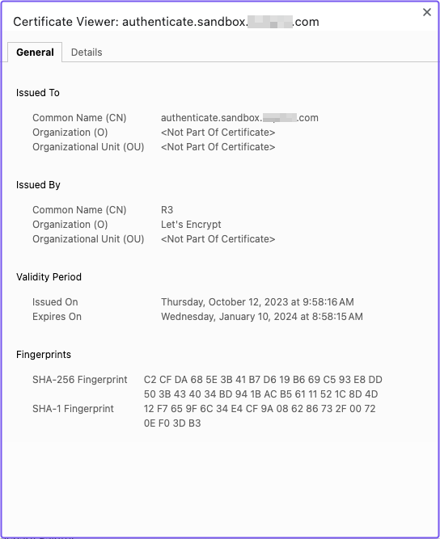

# Production Certificates With Autocert

In this tutorial, you’ll add production certificates with Autocert to your Pomerium instance.

:::note **Before You Start**

Make sure you’ve completed the following tutorials:

- [**Get Started**](/examples/fundamentals/get-started)
- [**Build a Simple Route**](/examples/fundamentals/build-routes)
- [**Build a Simple Policy**](/examples/fundamentals/build-policies)
- [**Identity Verification with JWTs**](/examples/fundamentals/jwt-verification)
- [**Build Advanced Policies**](/examples/fundamentals/advanced-policies)
- [**Build Advanced Routes**](/examples/fundamentals/advanced-routes)
- [**Build TCP Routes**](/examples/fundamentals/tcp-routes)
- [**Self-Host Pomerium**](/examples/fundamentals/self-hosted-pomerium)

Each tutorial builds on the same configuration files. In this tutorial, you’ll learn how to enable Autocert to manage TLS certificate automation for your upstream services.

:::

## About Autocert

To understand Autocert, it helps to understand one of the problems it solves:

**The Problem**

If you installed Pomerium in a VM instance, the default configuration file includes `certificates` keys where you can import your own certificates to secure the connection from Pomerium to the _upstream_ service.

If you don’t include certificates, Pomerium will generate self-signed certificates to secure these connections for you.

However, a self-signed certificate will prompt your browser to throw a self-signed certificate warning. To avoid this warning, you need to import and manage certificates yourself.

But, managing your own certificates can be tedious and difficult to maintain (especially as your services and routes scale).

**The Solution**

Fortunately, Pomerium has an Autocert setting that, when enabled, allows Pomerium to automatically retrieve, manage, and renew public-facing TLS certificates from [Let's Encrypt](https://letsencrypt.org/).

(If your OS trusts the [ISRG Root X1](https://letsencrypt.org/docs/certificate-compatibility/) certificate, it will validate Let’s Encrypt certificates, too.)

:::note

To be clear, Autocert enables Pomerium to generate _per-route_ certificates that authenticate the _upstream_ server and secure the _upstream_ connection. This means you won’t encounter the self-signed certificate warning when you access a route.

Autocert _does not_ secure the downstream connection (that is, the connection between the client and Pomerium).

:::

### How Autocert works with Pomerium

The Autocert setting relies on the **[Automatic Certificate Management Environment](https://datatracker.ietf.org/doc/html/rfc8555)** (ACME) protocol to automate the issuance and verification of certificates between a Certificate Authority (CA) and a user’s server (also known as the “applicant”).

We implement Autocert with Let’s Encrypt, which functions as the CA.

Your domain is the applicant.

Let’s Encrypt uses the ACME protocol to verify that you own a domain before it issues you a certificate for it. To verify that you own a domain, you need to satisfy one of the following challenges:

- [**HTTP-01 challenge**](https://letsencrypt.org/docs/client-options/#projects-integrating-with-let-s-encrypt)
- [**TLS-ALPN-01 challenge**](https://letsencrypt.org/docs/challenge-types/#tls-alpn-01)

(There are other challenges, but Pomerium only supports these two for now.)

After satisfying either of these challenges, Let’s Encrypt – and, in turn, Autocert – will retrieve, manage, and renew certificates for your domain.

## Configure Autocert

Configuring Autocert is simple. In your configuration file, comment out or delete the `certificates` keys. Replace them with the `autocert` setting:

```yaml title="config.yaml"
# certificate settings: https://www.pomerium.com/docs/reference/certificates.html*
autocert: true
# REMOVE FOR PRODUCTION*
# If you're using mkcert to test Pomerium locally, comment the autocert keys and uncomment*
# the keys below, adjusting for your mkcert path:*
# certificate_file: /home/user/.local/share/mkcert/rootCA.pem*
# certificate_key_file: /user/me/.local/share/mkcert/rootCA-key.pem*
```

## Run Pomerium

Now, run Pomerium to see if Autocert worked.

Select the Verify route. Now, click the **padlock** icon and view the certificate.

You should see your domain in the **Issued To > Common Name (CN)** field (the UI will vary depending on your browser, but you get the idea):



That’s it! You configured Pomerium to manage certificates for your upstream applications.

## Summary

Now that Pomerium is running on a VM with Autocert managing certificates, you have a fully functional reverse proxy for your access control needs.

With Pomerium’s setup complete, you’re ready to start adding and securing your own services behind Pomerium.

Head to our final tutorial, Putting It All Together, to see what you should do next.
